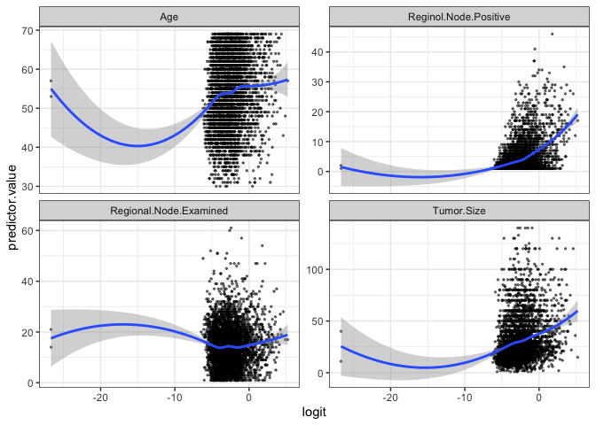

Breast cancer survival prediction
================
Tong Su, Minghe Wang, Kai Tan, Yifei Chen
2024-12-19

``` r
# Load dataset
data <- read.csv("./data/Project_2_data.csv")

# Clean dataset
lapply(data, table)
```

    ## $Age
    ## 
    ##  30  31  32  33  34  35  36  37  38  39  40  41  42  43  44  45  46  47  48  49 
    ##   5  14  13  15  14  20  24  28  45  52  72  71  82  92  79 102 163 161 140 162 
    ##  50  51  52  53  54  55  56  57  58  59  60  61  62  63  64  65  66  67  68  69 
    ## 144 148 118 155 128 154 132 144 120 147 140 143 149 153 116 122 119 119 111 108 
    ## 
    ## $Race
    ## 
    ## Black Other White 
    ##   291   320  3413 
    ## 
    ## $Marital.Status
    ## 
    ##  Divorced   Married Separated   Single    Widowed 
    ##       486      2643        45       615       235 
    ## 
    ## $T.Stage
    ## 
    ##   T1   T2   T3   T4 
    ## 1603 1786  533  102 
    ## 
    ## $N.Stage
    ## 
    ##   N1   N2   N3 
    ## 2732  820  472 
    ## 
    ## $X6th.Stage
    ## 
    ##  IIA  IIB IIIA IIIB IIIC 
    ## 1305 1130 1050   67  472 
    ## 
    ## $differentiate
    ## 
    ## Moderately differentiated     Poorly differentiated          Undifferentiated 
    ##                      2351                      1111                        19 
    ##       Well differentiated 
    ##                       543 
    ## 
    ## $Grade
    ## 
    ##  anaplastic; Grade IV                     1                     2 
    ##                    19                   543                  2351 
    ##                     3 
    ##                  1111 
    ## 
    ## $A.Stage
    ## 
    ##  Distant Regional 
    ##       92     3932 
    ## 
    ## $Tumor.Size
    ## 
    ##   1   2   3   4   5   6   7   8   9  10  11  12  13  14  15  16  17  18  19  20 
    ##   7  12   9  14  25  23  42  40  49  92  77 118  81  92 271 104 120 158  75 211 
    ##  21  22  23  24  25  26  27  28  29  30  31  32  33  34  35  36  37  38  39  40 
    ## 108 115  78  69 268  42  61  57  22 228  28  50  25  24 161  17  26  28  10 145 
    ##  41  42  43  44  45  46  47  48  49  50  51  52  53  54  55  56  57  58  59  60 
    ##   6  28  10   8  77   9  16  12   3  93  21  20   5   6  64   5   7   6   4  92 
    ##  61  62  63  64  65  66  67  68  69  70  72  73  74  75  76  77  78  79  80  81 
    ##   7   7  10   1  29   3   1   7   2  61   5   1   5  24   5   2   3   1  46   2 
    ##  82  83  84  85  86  87  88  90  92  94  95  96  97  98 100 101 103 104 105 107 
    ##   3   3   2  10   1   1   1  27   2   1   5   1   2   1  25   2   1   1   3   1 
    ## 108 110 115 117 120 123 125 130 133 140 
    ##   1   4   1   1  15   1   1   5   1   5 
    ## 
    ## $Estrogen.Status
    ## 
    ## Negative Positive 
    ##      269     3755 
    ## 
    ## $Progesterone.Status
    ## 
    ## Negative Positive 
    ##      698     3326 
    ## 
    ## $Regional.Node.Examined
    ## 
    ##   1   2   3   4   5   6   7   8   9  10  11  12  13  14  15  16  17  18  19  20 
    ##  97 137 116 114 110 115 104 148 198 183 191 205 251 225 195 221 175 176 152 126 
    ##  21  22  23  24  25  26  27  28  29  30  31  32  33  34  35  36  37  38  39  40 
    ## 109  82  98  84  58  64  49  45  34  27  20  22  13   8  10   9   8   4   6   5 
    ##  41  42  43  44  45  46  47  49  51  52  54  57  60  61 
    ##   6   2   3   1   1   1   6   2   3   1   1   1   1   1 
    ## 
    ## $Reginol.Node.Positive
    ## 
    ##    1    2    3    4    5    6    7    8    9   10   11   12   13   14   15   16 
    ## 1522  740  420  261  207  140  108   75   90   61   56   50   33   41   26   29 
    ##   17   18   19   20   21   22   23   24   25   26   27   28   29   30   31   32 
    ##   26   15   23   10   13   16    8    8    3   10    6    7    6    2    1    2 
    ##   33   34   35   37   41   46 
    ##    2    2    1    2    1    1 
    ## 
    ## $Survival.Months
    ## 
    ##   1   2   3   4   5   6   7   8   9  10  11  12  13  14  15  16  17  18  19  20 
    ##   1   3   4  10   6   8   5   7   9   8   4   6  12  10   6   8   6  11   5  10 
    ##  21  22  23  24  25  26  27  28  29  30  31  32  33  34  35  36  37  38  39  40 
    ##   7  11  16  12  12   5  13   8   7  10  15   5   9  11  11  11  11  13   9  18 
    ##  41  42  43  44  45  46  47  48  49  50  51  52  53  54  55  56  57  58  59  60 
    ##  24  14  10  16  16  14  26  54  61  67  55  62  61  59  63  73  53  61  61  63 
    ##  61  62  63  64  65  66  67  68  69  70  71  72  73  74  75  76  77  78  79  80 
    ##  60  52  73  62  55  71  61  63  81  49  41  57  55  56  65  59  64  56  55  68 
    ##  81  82  83  84  85  86  87  88  89  90  91  92  93  94  95  96  97  98  99 100 
    ##  68  61  66  58  52  57  53  63  66  43  51  49  62  57  67  54  57  72  55  66 
    ## 101 102 103 104 105 106 107 
    ##  54  73  50  48  45  47  61 
    ## 
    ## $Status
    ## 
    ## Alive  Dead 
    ##  3408   616

``` r
data_cleaned <- data %>%
  mutate(
    Race = factor(Race),
    Marital.Status = factor(trimws(Marital.Status)),
    T.Stage = factor(T.Stage),
    N.Stage = factor(N.Stage),
    X6th.Stage = factor(X6th.Stage),
    differentiate = factor(differentiate),
    Grade = factor(trimws(Grade)),  # Trim spaces before factoring
    A.Stage = factor(A.Stage),
    Estrogen.Status = factor(Estrogen.Status),
    Progesterone.Status = factor(Progesterone.Status),
    Status = factor(Status)
  ) %>% 
  mutate(
    T.Stage = as.numeric(factor(T.Stage, levels = c("T1", "T2", "T3", "T4"), ordered = TRUE)),
    N.Stage = as.numeric(factor(N.Stage, levels = c("N1", "N2", "N3"), ordered = TRUE)),
    X6th.Stage = as.numeric(factor(X6th.Stage, levels = c("IIA", "IIB", "IIIA", "IIIB", "IIIC"), ordered = TRUE)),
    Grade = as.numeric(factor(Grade, levels = c("1", "2", "3", "anaplastic; Grade IV"), ordered = TRUE)),
    A.Stage = as.numeric(factor(A.Stage, levels = c("Regional", "Distant"), ordered = TRUE))
  ) %>% 
  select(-differentiate)
```

`Grade` and `differentiate` are redundant variables, so we drop
`differentiate`.

# 1. Descriptive Summary

``` r
# summary_stats for numeric predictors
summary_numeric <- data_cleaned |> 
  select_if(is.numeric) |>
  summarise_all(list(
    mean = ~mean(.x, na.rm = TRUE), 
    median = ~median(.x, na.rm = TRUE), 
    sd = ~sd(.x, na.rm = TRUE),
    min = ~min(.x, na.rm = TRUE),
    max = ~max(.x, na.rm = TRUE),
    iqr = ~IQR(.x, na.rm = TRUE),
    count = ~sum(!is.na(.x))
  ))

summary_numeric_long <- summary_numeric |> 
  pivot_longer(
    cols = everything(),        
    names_to = c("Variable", "Statistic"), 
    names_sep = "_",            
    values_to = "Value"         
  )
summary_numeric_wide <- summary_numeric_long |> 
  pivot_wider(
    names_from = Statistic,    
    values_from = Value         
  )
summary_numeric_wide
```

    ## # A tibble: 10 × 8
    ##    Variable                mean median     sd   min   max   iqr count
    ##    <chr>                  <dbl>  <dbl>  <dbl> <dbl> <dbl> <dbl> <dbl>
    ##  1 Age                    54.0      54  8.96     30    69    14  4024
    ##  2 T.Stage                 1.78      2  0.766     1     4     1  4024
    ##  3 N.Stage                 1.44      1  0.693     1     3     1  4024
    ##  4 X6th.Stage              2.32      2  1.27      1     5     2  4024
    ##  5 Grade                   2.15      2  0.638     1     4     1  4024
    ##  6 A.Stage                 1.02      1  0.149     1     2     0  4024
    ##  7 Tumor.Size             30.5      25 21.1       1   140    22  4024
    ##  8 Regional.Node.Examined 14.4      14  8.10      1    61    10  4024
    ##  9 Reginol.Node.Positive   4.16      2  5.11      1    46     4  4024
    ## 10 Survival.Months        71.3      73 22.9       1   107    34  4024

``` r
# Missing data
missing_percentage <- data_cleaned |> 
  summarise(across(everything(), ~ mean(is.na(.)) * 100, .names = "missing_pct_{.col}"))
missing_percentage
```

    ##   missing_pct_Age missing_pct_Race missing_pct_Marital.Status
    ## 1               0                0                          0
    ##   missing_pct_T.Stage missing_pct_N.Stage missing_pct_X6th.Stage
    ## 1                   0                   0                      0
    ##   missing_pct_Grade missing_pct_A.Stage missing_pct_Tumor.Size
    ## 1                 0                   0                      0
    ##   missing_pct_Estrogen.Status missing_pct_Progesterone.Status
    ## 1                           0                               0
    ##   missing_pct_Regional.Node.Examined missing_pct_Reginol.Node.Positive
    ## 1                                  0                                 0
    ##   missing_pct_Survival.Months missing_pct_Status
    ## 1                           0                  0

# 2. Data Visualization

``` r
# Distribution of continuous variables
numeric_vars <- data_cleaned |> select_if(is.numeric)

# Histogram for continuous variables
for (col in names(numeric_vars)) {
  ggplot(data_cleaned, aes_string(x = col)) +
    geom_histogram(bins = 30, fill = "blue", color = "black") +
    ggtitle(paste("Distribution of", col)) +
    theme_minimal()
}
```

    ## Warning: `aes_string()` was deprecated in ggplot2 3.0.0.
    ## ℹ Please use tidy evaluation idioms with `aes()`.
    ## ℹ See also `vignette("ggplot2-in-packages")` for more information.
    ## This warning is displayed once every 8 hours.
    ## Call `lifecycle::last_lifecycle_warnings()` to see where this warning was
    ## generated.

``` r
# Scatter plot for continuous variables
predictors = c("Age", "Tumor.Size", "Regional.Node.Examined", "Reginol.Node.Positive")
sorted_data = melt(data_cleaned, id.vars = "Survival.Months", measure.vars = predictors)
ggplot(sorted_data, aes(x = value, y = Survival.Months)) +
  geom_point(alpha = 1) +
  geom_smooth(method = "lm", color = "blue") +
  facet_wrap(~variable, scales = "free_x") +  
  labs(title = "Scatter Plots of Predictors vs Survival Time",
       x = "Predictor Value",
       y = "Survival Time (Months)") +
  theme_minimal()
```

    ## `geom_smooth()` using formula = 'y ~ x'

<!-- -->

``` r
# Correlation heatmap with correlation coefficient
cor_matrix <- cor(numeric_vars, use = "complete.obs")
corrplot(cor_matrix, method = "number", type = "full", tl.col = "black", tl.srt = 45, title = "Correlation Heatmap")
```

<!-- -->

``` r
# Bar Plot for categorical variables
categorical_vars <- names(data_cleaned)[sapply(data_cleaned, is.factor) | sapply(data_cleaned, is.character)]
if (length(categorical_vars) > 0) {
  for (var in categorical_vars) {
    p <- ggplot(data_cleaned, aes_string(x = var, fill = var)) +
      geom_bar() +
      labs(
        title = paste("Distribution of", var),
        x = var,
        y = "Count"
      ) +
      theme_minimal() +
      scale_fill_brewer(palette = "Set2")  
    
    print(p)  
  }
} else {
  message("No categorical variables found in the dataset.")
}
```

<!-- --><!-- --><!-- --><!-- --><!-- -->

``` r
#show pairs with strong correlation
for (i in 1:(nrow(cor_matrix) - 1)) {
  for (j in (i + 1):ncol(cor_matrix)) {
    if (abs(cor_matrix[i, j]) > 0.7) {
      cat("Pairs with strong correlation:", rownames(cor_matrix)[i], "~", colnames(cor_matrix)[j], 
          "with correlation =", cor_matrix[i, j], "\n")
    }
  }
}
```

    ## Pairs with strong correlation: T.Stage ~ Tumor.Size with correlation = 0.8091755 
    ## Pairs with strong correlation: N.Stage ~ X6th.Stage with correlation = 0.8818801 
    ## Pairs with strong correlation: N.Stage ~ Reginol.Node.Positive with correlation = 0.8380733 
    ## Pairs with strong correlation: X6th.Stage ~ Reginol.Node.Positive with correlation = 0.7739631

``` r
#show pairs with weak correlation
for (i in 1:(nrow(cor_matrix) - 1)) {
  for (j in (i + 1):ncol(cor_matrix)) {
    if (abs(cor_matrix[i, j]) > 0.2 & abs(cor_matrix[i, j]) < 0.4) {
      cat("Pairs with weak correlation:", rownames(cor_matrix)[i], "~", colnames(cor_matrix)[j], 
          "with correlation =", cor_matrix[i, j], "\n")
    }
  }
}
```

    ## Pairs with weak correlation: T.Stage ~ N.Stage with correlation = 0.2770145 
    ## Pairs with weak correlation: T.Stage ~ A.Stage with correlation = 0.2211235 
    ## Pairs with weak correlation: T.Stage ~ Reginol.Node.Positive with correlation = 0.2430749 
    ## Pairs with weak correlation: N.Stage ~ A.Stage with correlation = 0.2605729 
    ## Pairs with weak correlation: N.Stage ~ Tumor.Size with correlation = 0.2779047 
    ## Pairs with weak correlation: N.Stage ~ Regional.Node.Examined with correlation = 0.3282761 
    ## Pairs with weak correlation: X6th.Stage ~ A.Stage with correlation = 0.2919618 
    ## Pairs with weak correlation: X6th.Stage ~ Regional.Node.Examined with correlation = 0.3172187 
    ## Pairs with weak correlation: A.Stage ~ Reginol.Node.Positive with correlation = 0.2328489 
    ## Pairs with weak correlation: Tumor.Size ~ Reginol.Node.Positive with correlation = 0.2423217

# 3. Model Building: Survival Analysis

``` r
# Convert Status to binary (Dead = 1, Alive = 0)
data$Status <- ifelse(data$Status == "Dead", 1, 0)

# Build Cox Proportional Hazards model
cox_model <- coxph(Surv(Survival.Months, Status) ~ ., data = data)
summary(cox_model)
```

    ## Call:
    ## coxph(formula = Surv(Survival.Months, Status) ~ ., data = data)
    ## 
    ##   n= 4024, number of events= 616 
    ## 
    ##                                         coef exp(coef)  se(coef)      z
    ## Age                                 0.020463  1.020673  0.004873  4.200
    ## RaceOther                          -0.736866  0.478612  0.214042 -3.443
    ## RaceWhite                          -0.370655  0.690282  0.129776 -2.856
    ## Marital.StatusMarried              -0.203376  0.815971  0.119228 -1.706
    ## Marital.StatusSeparated             0.391784  1.479619  0.290182  1.350
    ## Marital.StatusSingle               -0.030024  0.970422  0.146084 -0.206
    ## Marital.StatusWidowed              -0.030182  0.970269  0.181574 -0.166
    ## T.StageT2                           0.201182  1.222847  0.160641  1.252
    ## T.StageT3                           0.354265  1.425133  0.253364  1.398
    ## T.StageT4                           0.637921  1.892542  0.313356  2.036
    ## N.StageN2                           0.568511  1.765636  0.203140  2.799
    ## N.StageN3                           0.756433  2.130663  0.240152  3.150
    ## X6th.StageIIB                       0.269771  1.309664  0.201799  1.337
    ## X6th.StageIIIA                      0.027973  1.028368  0.254824  0.110
    ## X6th.StageIIIB                      0.202537  1.224505  0.395992  0.511
    ## X6th.StageIIIC                            NA        NA  0.000000     NA
    ## differentiatePoorly differentiated  0.351803  1.421629  0.089308  3.939
    ## differentiateUndifferentiated       1.104912  3.018960  0.349828  3.158
    ## differentiateWell differentiated   -0.449352  0.638042  0.171180 -2.625
    ## Grade1                                    NA        NA  0.000000     NA
    ## Grade2                                    NA        NA  0.000000     NA
    ## Grade3                                    NA        NA  0.000000     NA
    ## A.StageRegional                    -0.150448  0.860322  0.194018 -0.775
    ## Tumor.Size                          0.001680  1.001681  0.003161  0.531
    ## Estrogen.StatusPositive            -0.648532  0.522813  0.135622 -4.782
    ## Progesterone.StatusPositive        -0.486487  0.614782  0.106949 -4.549
    ## Regional.Node.Examined             -0.033013  0.967526  0.006492 -5.085
    ## Reginol.Node.Positive               0.058490  1.060234  0.011353  5.152
    ##                                    Pr(>|z|)    
    ## Age                                2.67e-05 ***
    ## RaceOther                          0.000576 ***
    ## RaceWhite                          0.004289 ** 
    ## Marital.StatusMarried              0.088051 .  
    ## Marital.StatusSeparated            0.176973    
    ## Marital.StatusSingle               0.837162    
    ## Marital.StatusWidowed              0.867980    
    ## T.StageT2                          0.210435    
    ## T.StageT3                          0.162038    
    ## T.StageT4                          0.041773 *  
    ## N.StageN2                          0.005132 ** 
    ## N.StageN3                          0.001634 ** 
    ## X6th.StageIIB                      0.181279    
    ## X6th.StageIIIA                     0.912589    
    ## X6th.StageIIIB                     0.609025    
    ## X6th.StageIIIC                           NA    
    ## differentiatePoorly differentiated 8.18e-05 ***
    ## differentiateUndifferentiated      0.001586 ** 
    ## differentiateWell differentiated   0.008664 ** 
    ## Grade1                                   NA    
    ## Grade2                                   NA    
    ## Grade3                                   NA    
    ## A.StageRegional                    0.438084    
    ## Tumor.Size                         0.595099    
    ## Estrogen.StatusPositive            1.74e-06 ***
    ## Progesterone.StatusPositive        5.40e-06 ***
    ## Regional.Node.Examined             3.67e-07 ***
    ## Reginol.Node.Positive              2.58e-07 ***
    ## ---
    ## Signif. codes:  0 '***' 0.001 '**' 0.01 '*' 0.05 '.' 0.1 ' ' 1
    ## 
    ##                                    exp(coef) exp(-coef) lower .95 upper .95
    ## Age                                   1.0207     0.9797    1.0110    1.0305
    ## RaceOther                             0.4786     2.0894    0.3146    0.7281
    ## RaceWhite                             0.6903     1.4487    0.5353    0.8902
    ## Marital.StatusMarried                 0.8160     1.2255    0.6459    1.0308
    ## Marital.StatusSeparated               1.4796     0.6758    0.8378    2.6131
    ## Marital.StatusSingle                  0.9704     1.0305    0.7288    1.2921
    ## Marital.StatusWidowed                 0.9703     1.0306    0.6797    1.3850
    ## T.StageT2                             1.2228     0.8178    0.8926    1.6754
    ## T.StageT3                             1.4251     0.7017    0.8673    2.3416
    ## T.StageT4                             1.8925     0.5284    1.0240    3.4976
    ## N.StageN2                             1.7656     0.5664    1.1857    2.6291
    ## N.StageN3                             2.1307     0.4693    1.3308    3.4114
    ## X6th.StageIIB                         1.3097     0.7636    0.8818    1.9451
    ## X6th.StageIIIA                        1.0284     0.9724    0.6241    1.6946
    ## X6th.StageIIIB                        1.2245     0.8167    0.5635    2.6609
    ## X6th.StageIIIC                            NA         NA        NA        NA
    ## differentiatePoorly differentiated    1.4216     0.7034    1.1933    1.6936
    ## differentiateUndifferentiated         3.0190     0.3312    1.5208    5.9928
    ## differentiateWell differentiated      0.6380     1.5673    0.4562    0.8924
    ## Grade1                                    NA         NA        NA        NA
    ## Grade2                                    NA         NA        NA        NA
    ## Grade3                                    NA         NA        NA        NA
    ## A.StageRegional                       0.8603     1.1624    0.5882    1.2584
    ## Tumor.Size                            1.0017     0.9983    0.9955    1.0079
    ## Estrogen.StatusPositive               0.5228     1.9127    0.4008    0.6820
    ## Progesterone.StatusPositive           0.6148     1.6266    0.4985    0.7582
    ## Regional.Node.Examined                0.9675     1.0336    0.9553    0.9799
    ## Reginol.Node.Positive                 1.0602     0.9432    1.0369    1.0841
    ## 
    ## Concordance= 0.744  (se = 0.011 )
    ## Likelihood ratio test= 501.6  on 24 df,   p=<2e-16
    ## Wald test            = 570.2  on 24 df,   p=<2e-16
    ## Score (logrank) test = 665  on 24 df,   p=<2e-16

``` r
# Save model summary
tidy_cox <- broom::tidy(cox_model)
write.csv(tidy_cox, "cox_model_summary.csv")

# Evaluate Model Performance
# Concordance index
c_index <- summary(cox_model)$concordance
cat("Concordance Index:", c_index, "\n")
```

    ## Concordance Index: 0.7437448 0.01069854

# 4. Model Building: Logistic Regression

## Varibales selection

``` r
# Building model
logistic_full <- glm(Status ~ . + T.Stage*Tumor.Size + N.Stage*X6th.Stage + N.Stage*Reginol.Node.Positive + X6th.Stage*Reginol.Node.Positive, family = binomial, data = data_cleaned)
logistic_null <- glm(Status ~ 1, family = binomial, data = data_cleaned)

# backward selection
backward_model <- step(logistic_full, direction = "backward")
```

    ## Start:  AIC=2283.04
    ## Status ~ Age + Race + Marital.Status + T.Stage + N.Stage + X6th.Stage + 
    ##     Grade + A.Stage + Tumor.Size + Estrogen.Status + Progesterone.Status + 
    ##     Regional.Node.Examined + Reginol.Node.Positive + Survival.Months + 
    ##     T.Stage * Tumor.Size + N.Stage * X6th.Stage + N.Stage * Reginol.Node.Positive + 
    ##     X6th.Stage * Reginol.Node.Positive
    ## 
    ##                                    Df Deviance    AIC
    ## - Marital.Status                    4   2240.2 2278.2
    ## - T.Stage:Tumor.Size                1   2237.0 2281.0
    ## - N.Stage:X6th.Stage                1   2237.1 2281.1
    ## - X6th.Stage:Reginol.Node.Positive  1   2237.1 2281.1
    ## - A.Stage                           1   2237.2 2281.2
    ## - N.Stage:Reginol.Node.Positive     1   2237.3 2281.3
    ## <none>                                  2237.0 2283.0
    ## - Estrogen.Status                   1   2240.2 2284.2
    ## - Race                              2   2247.2 2289.2
    ## - Progesterone.Status               1   2247.7 2291.7
    ## - Regional.Node.Examined            1   2252.9 2296.9
    ## - Age                               1   2255.9 2299.9
    ## - Grade                             1   2266.3 2310.3
    ## - Survival.Months                   1   2955.5 2999.5
    ## 
    ## Step:  AIC=2278.21
    ## Status ~ Age + Race + T.Stage + N.Stage + X6th.Stage + Grade + 
    ##     A.Stage + Tumor.Size + Estrogen.Status + Progesterone.Status + 
    ##     Regional.Node.Examined + Reginol.Node.Positive + Survival.Months + 
    ##     T.Stage:Tumor.Size + N.Stage:X6th.Stage + N.Stage:Reginol.Node.Positive + 
    ##     X6th.Stage:Reginol.Node.Positive
    ## 
    ##                                    Df Deviance    AIC
    ## - T.Stage:Tumor.Size                1   2240.2 2276.2
    ## - N.Stage:X6th.Stage                1   2240.3 2276.3
    ## - X6th.Stage:Reginol.Node.Positive  1   2240.3 2276.3
    ## - A.Stage                           1   2240.4 2276.4
    ## - N.Stage:Reginol.Node.Positive     1   2240.4 2276.4
    ## <none>                                  2240.2 2278.2
    ## - Estrogen.Status                   1   2243.3 2279.3
    ## - Race                              2   2251.6 2285.6
    ## - Progesterone.Status               1   2251.4 2287.4
    ## - Regional.Node.Examined            1   2256.1 2292.1
    ## - Age                               1   2261.3 2297.3
    ## - Grade                             1   2269.4 2305.4
    ## - Survival.Months                   1   2963.6 2999.6
    ## 
    ## Step:  AIC=2276.22
    ## Status ~ Age + Race + T.Stage + N.Stage + X6th.Stage + Grade + 
    ##     A.Stage + Tumor.Size + Estrogen.Status + Progesterone.Status + 
    ##     Regional.Node.Examined + Reginol.Node.Positive + Survival.Months + 
    ##     N.Stage:X6th.Stage + N.Stage:Reginol.Node.Positive + X6th.Stage:Reginol.Node.Positive
    ## 
    ##                                    Df Deviance    AIC
    ## - N.Stage:X6th.Stage                1   2240.3 2274.3
    ## - X6th.Stage:Reginol.Node.Positive  1   2240.3 2274.3
    ## - A.Stage                           1   2240.4 2274.4
    ## - N.Stage:Reginol.Node.Positive     1   2240.4 2274.4
    ## - Tumor.Size                        1   2241.9 2275.9
    ## <none>                                  2240.2 2276.2
    ## - Estrogen.Status                   1   2243.3 2277.3
    ## - Race                              2   2251.7 2283.7
    ## - T.Stage                           1   2250.8 2284.8
    ## - Progesterone.Status               1   2251.4 2285.4
    ## - Regional.Node.Examined            1   2256.1 2290.1
    ## - Age                               1   2261.3 2295.3
    ## - Grade                             1   2269.4 2303.4
    ## - Survival.Months                   1   2965.1 2999.1
    ## 
    ## Step:  AIC=2274.29
    ## Status ~ Age + Race + T.Stage + N.Stage + X6th.Stage + Grade + 
    ##     A.Stage + Tumor.Size + Estrogen.Status + Progesterone.Status + 
    ##     Regional.Node.Examined + Reginol.Node.Positive + Survival.Months + 
    ##     N.Stage:Reginol.Node.Positive + X6th.Stage:Reginol.Node.Positive
    ## 
    ##                                    Df Deviance    AIC
    ## - X6th.Stage:Reginol.Node.Positive  1   2240.3 2272.3
    ## - N.Stage:Reginol.Node.Positive     1   2240.4 2272.4
    ## - A.Stage                           1   2240.5 2272.5
    ## - Tumor.Size                        1   2242.1 2274.1
    ## <none>                                  2240.3 2274.3
    ## - Estrogen.Status                   1   2243.4 2275.4
    ## - Race                              2   2251.7 2281.7
    ## - Progesterone.Status               1   2251.4 2283.4
    ## - T.Stage                           1   2251.5 2283.5
    ## - Regional.Node.Examined            1   2256.1 2288.1
    ## - Age                               1   2261.6 2293.6
    ## - Grade                             1   2269.5 2301.5
    ## - Survival.Months                   1   2965.4 2997.4
    ## 
    ## Step:  AIC=2272.32
    ## Status ~ Age + Race + T.Stage + N.Stage + X6th.Stage + Grade + 
    ##     A.Stage + Tumor.Size + Estrogen.Status + Progesterone.Status + 
    ##     Regional.Node.Examined + Reginol.Node.Positive + Survival.Months + 
    ##     N.Stage:Reginol.Node.Positive
    ## 
    ##                                 Df Deviance    AIC
    ## - A.Stage                        1   2240.5 2270.5
    ## - X6th.Stage                     1   2240.6 2270.6
    ## - N.Stage:Reginol.Node.Positive  1   2241.0 2271.0
    ## - Tumor.Size                     1   2242.1 2272.1
    ## <none>                               2240.3 2272.3
    ## - Estrogen.Status                1   2243.5 2273.5
    ## - Race                           2   2251.7 2279.7
    ## - Progesterone.Status            1   2251.5 2281.5
    ## - T.Stage                        1   2251.5 2281.5
    ## - Regional.Node.Examined         1   2256.3 2286.3
    ## - Age                            1   2261.6 2291.6
    ## - Grade                          1   2269.5 2299.5
    ## - Survival.Months                1   2965.9 2995.9
    ## 
    ## Step:  AIC=2270.48
    ## Status ~ Age + Race + T.Stage + N.Stage + X6th.Stage + Grade + 
    ##     Tumor.Size + Estrogen.Status + Progesterone.Status + Regional.Node.Examined + 
    ##     Reginol.Node.Positive + Survival.Months + N.Stage:Reginol.Node.Positive
    ## 
    ##                                 Df Deviance    AIC
    ## - X6th.Stage                     1   2240.8 2268.8
    ## - N.Stage:Reginol.Node.Positive  1   2241.2 2269.2
    ## - Tumor.Size                     1   2242.2 2270.2
    ## <none>                               2240.5 2270.5
    ## - Estrogen.Status                1   2243.6 2271.6
    ## - Race                           2   2251.9 2277.9
    ## - T.Stage                        1   2251.5 2279.5
    ## - Progesterone.Status            1   2251.7 2279.7
    ## - Regional.Node.Examined         1   2256.3 2284.3
    ## - Age                            1   2262.0 2290.0
    ## - Grade                          1   2269.9 2297.9
    ## - Survival.Months                1   2965.9 2993.9
    ## 
    ## Step:  AIC=2268.83
    ## Status ~ Age + Race + T.Stage + N.Stage + Grade + Tumor.Size + 
    ##     Estrogen.Status + Progesterone.Status + Regional.Node.Examined + 
    ##     Reginol.Node.Positive + Survival.Months + N.Stage:Reginol.Node.Positive
    ## 
    ##                                 Df Deviance    AIC
    ## - N.Stage:Reginol.Node.Positive  1   2241.8 2267.8
    ## - Tumor.Size                     1   2242.4 2268.4
    ## <none>                               2240.8 2268.8
    ## - Estrogen.Status                1   2243.9 2269.9
    ## - Race                           2   2252.4 2276.4
    ## - Progesterone.Status            1   2251.9 2277.9
    ## - T.Stage                        1   2255.3 2281.3
    ## - Regional.Node.Examined         1   2256.7 2282.7
    ## - Age                            1   2262.2 2288.2
    ## - Grade                          1   2270.1 2296.1
    ## - Survival.Months                1   2966.0 2992.0
    ## 
    ## Step:  AIC=2267.77
    ## Status ~ Age + Race + T.Stage + N.Stage + Grade + Tumor.Size + 
    ##     Estrogen.Status + Progesterone.Status + Regional.Node.Examined + 
    ##     Reginol.Node.Positive + Survival.Months
    ## 
    ##                          Df Deviance    AIC
    ## - Tumor.Size              1   2243.2 2267.2
    ## <none>                        2241.8 2267.8
    ## - Estrogen.Status         1   2244.8 2268.8
    ## - N.Stage                 1   2247.9 2271.9
    ## - Race                    2   2253.4 2275.4
    ## - Progesterone.Status     1   2252.8 2276.8
    ## - T.Stage                 1   2256.8 2280.8
    ## - Regional.Node.Examined  1   2257.4 2281.4
    ## - Reginol.Node.Positive   1   2260.8 2284.8
    ## - Age                     1   2263.1 2287.1
    ## - Grade                   1   2271.2 2295.2
    ## - Survival.Months         1   2966.7 2990.7
    ## 
    ## Step:  AIC=2267.23
    ## Status ~ Age + Race + T.Stage + N.Stage + Grade + Estrogen.Status + 
    ##     Progesterone.Status + Regional.Node.Examined + Reginol.Node.Positive + 
    ##     Survival.Months
    ## 
    ##                          Df Deviance    AIC
    ## <none>                        2243.2 2267.2
    ## - Estrogen.Status         1   2246.2 2268.2
    ## - N.Stage                 1   2248.9 2270.9
    ## - Race                    2   2254.7 2274.7
    ## - Progesterone.Status     1   2254.2 2276.2
    ## - Regional.Node.Examined  1   2258.8 2280.8
    ## - Reginol.Node.Positive   1   2262.3 2284.3
    ## - T.Stage                 1   2264.6 2286.6
    ## - Age                     1   2265.2 2287.2
    ## - Grade                   1   2273.0 2295.0
    ## - Survival.Months         1   2967.1 2989.1

``` r
# forward selection
forward_model <- step(logistic_null, scope = list(lower = logistic_full, upper = logistic_null), direction = "forward")
```

    ## Start:  AIC=3446.68
    ## Status ~ 1

``` r
# stepwise selection
stepwise <- step(logistic_null, scope = list(lower = logistic_full, upper = logistic_null), direction = "both")
```

    ## Start:  AIC=3446.68
    ## Status ~ 1

``` r
# examine if the same model was build
formula(backward_model)
```

    ## Status ~ Age + Race + T.Stage + N.Stage + Grade + Estrogen.Status + 
    ##     Progesterone.Status + Regional.Node.Examined + Reginol.Node.Positive + 
    ##     Survival.Months

``` r
formula(forward_model)
```

    ## Status ~ 1

``` r
formula(stepwise)
```

    ## Status ~ 1

``` r
# check if there is a close call
summary(backward_model)
```

    ## 
    ## Call:
    ## glm(formula = Status ~ Age + Race + T.Stage + N.Stage + Grade + 
    ##     Estrogen.Status + Progesterone.Status + Regional.Node.Examined + 
    ##     Reginol.Node.Positive + Survival.Months, family = binomial, 
    ##     data = data_cleaned)
    ## 
    ## Coefficients:
    ##                              Estimate Std. Error z value Pr(>|z|)    
    ## (Intercept)                 -0.422654   0.537693  -0.786 0.431838    
    ## Age                          0.029137   0.006287   4.634 3.58e-06 ***
    ## RaceOther                   -0.937676   0.286598  -3.272 0.001069 ** 
    ## RaceWhite                   -0.474423   0.185175  -2.562 0.010406 *  
    ## T.Stage                      0.332547   0.071744   4.635 3.57e-06 ***
    ## N.Stage                      0.297392   0.124393   2.391 0.016814 *  
    ## Grade                        0.500656   0.092751   5.398 6.74e-08 ***
    ## Estrogen.StatusPositive     -0.389678   0.224930  -1.732 0.083196 .  
    ## Progesterone.StatusPositive -0.509437   0.151281  -3.367 0.000759 ***
    ## Regional.Node.Examined      -0.030766   0.007996  -3.848 0.000119 ***
    ## Reginol.Node.Positive        0.073295   0.016811   4.360 1.30e-05 ***
    ## Survival.Months             -0.061348   0.002743 -22.364  < 2e-16 ***
    ## ---
    ## Signif. codes:  0 '***' 0.001 '**' 0.01 '*' 0.05 '.' 0.1 ' ' 1
    ## 
    ## (Dispersion parameter for binomial family taken to be 1)
    ## 
    ##     Null deviance: 3444.7  on 4023  degrees of freedom
    ## Residual deviance: 2243.2  on 4012  degrees of freedom
    ## AIC: 2267.2
    ## 
    ## Number of Fisher Scoring iterations: 6

``` r
summary(forward_model)
```

    ## 
    ## Call:
    ## glm(formula = Status ~ 1, family = binomial, data = data_cleaned)
    ## 
    ## Coefficients:
    ##             Estimate Std. Error z value Pr(>|z|)    
    ## (Intercept) -1.71063    0.04378  -39.08   <2e-16 ***
    ## ---
    ## Signif. codes:  0 '***' 0.001 '**' 0.01 '*' 0.05 '.' 0.1 ' ' 1
    ## 
    ## (Dispersion parameter for binomial family taken to be 1)
    ## 
    ##     Null deviance: 3444.7  on 4023  degrees of freedom
    ## Residual deviance: 3444.7  on 4023  degrees of freedom
    ## AIC: 3446.7
    ## 
    ## Number of Fisher Scoring iterations: 3

``` r
summary(stepwise)
```

    ## 
    ## Call:
    ## glm(formula = Status ~ 1, family = binomial, data = data_cleaned)
    ## 
    ## Coefficients:
    ##             Estimate Std. Error z value Pr(>|z|)    
    ## (Intercept) -1.71063    0.04378  -39.08   <2e-16 ***
    ## ---
    ## Signif. codes:  0 '***' 0.001 '**' 0.01 '*' 0.05 '.' 0.1 ' ' 1
    ## 
    ## (Dispersion parameter for binomial family taken to be 1)
    ## 
    ##     Null deviance: 3444.7  on 4023  degrees of freedom
    ## Residual deviance: 3444.7  on 4023  degrees of freedom
    ## AIC: 3446.7
    ## 
    ## Number of Fisher Scoring iterations: 3

``` r
# results
results <- data.frame(
Model = c("forward", "backward", "stepwise"),
AIC = c(AIC(forward_model), AIC(backward_model), AIC(stepwise)), 
BIC = c(BIC(forward_model), BIC(backward_model), BIC(stepwise))
) 
results
```

    ##      Model      AIC      BIC
    ## 1  forward 3446.683 3452.983
    ## 2 backward 2267.233 2342.833
    ## 3 stepwise 3446.683 3452.983

``` r
#compare AIC with and without Estrogen.StatusPosive
Estrogen.Status_included_backward = glm(Status ~ Age + Race + T.Stage + N.Stage + Grade + Estrogen.Status + Progesterone.Status + Regional.Node.Examined + Reginol.Node.Positive + Survival.Months, family = binomial, data = data_cleaned)

Estrogen.Status_excluded_backward = glm(Status ~ Age + Race + T.Stage + N.Stage + Grade + Progesterone.Status + Regional.Node.Examined + Reginol.Node.Positive + Survival.Months, family = binomial, data = data_cleaned) 

result1 <- data.frame(
Model = c("with Estrogen.StatusPosive", "without Estrogen.StatusPosive"),
AIC = c(AIC(Estrogen.Status_included_backward), AIC(Estrogen.Status_excluded_backward)), 
BIC = c(BIC(Estrogen.Status_included_backward), BIC(Estrogen.Status_excluded_backward))
) 
result1
```

    ##                           Model      AIC      BIC
    ## 1    with Estrogen.StatusPosive 2267.233 2342.833
    ## 2 without Estrogen.StatusPosive 2268.216 2337.516

``` r
#compare AIC with and without N.Stage*Regional.Node.Positive
Interaction_included_backward = glm(Status ~ Age + Race + T.Stage + N.Stage + Grade + Estrogen.Status + Progesterone.Status + Regional.Node.Examined + Reginol.Node.Positive + Survival.Months + N.Stage*Reginol.Node.Positive, family = binomial, data = data_cleaned)

Interaction_excluded_backward = glm(Status ~ Age + Race + T.Stage + N.Stage + Grade + Estrogen.Status + Progesterone.Status + Regional.Node.Examined + Reginol.Node.Positive + Survival.Months, family = binomial, data = data_cleaned)

result2 <- data.frame(
Model = c("with N.Stage*Regional.Node.Positive", "without N.Stage*Regional.Node.Positive"),
AIC = c(AIC(Interaction_included_backward), AIC(Interaction_excluded_backward)), 
BIC = c(BIC(Interaction_included_backward), BIC(Interaction_excluded_backward))
) 
result2
```

    ##                                    Model      AIC      BIC
    ## 1    with N.Stage*Regional.Node.Positive 2268.356 2350.256
    ## 2 without N.Stage*Regional.Node.Positive 2267.233 2342.833

``` r
#compare AIC with and without N.Stage
Nstage_included_backward = glm(Status ~ Age + Race + T.Stage + N.Stage + Grade + Estrogen.Status + Progesterone.Status + Regional.Node.Examined + Reginol.Node.Positive + Survival.Months, family = binomial, data = data_cleaned)

Nstage_excluded_backward = glm(Status ~ Age + Race + T.Stage + Grade + Estrogen.Status + Progesterone.Status + Regional.Node.Examined + Reginol.Node.Positive + Survival.Months, family = binomial, data = data_cleaned)

result3 <- data.frame(
Model = c("with N.Stage", "without N.Stage"),
AIC = c(AIC(Nstage_included_backward), AIC(Nstage_excluded_backward)), 
BIC = c(BIC(Nstage_included_backward), BIC(Nstage_excluded_backward))
) 
result3
```

    ##             Model      AIC      BIC
    ## 1    with N.Stage 2267.233 2342.833
    ## 2 without N.Stage 2270.923 2340.224

``` r
#compare AIC with and without Regional.Node.Positive
RNP_included_backward = glm(Status ~ Age + Race + T.Stage + N.Stage + Grade + Estrogen.Status + Progesterone.Status + Regional.Node.Examined + Reginol.Node.Positive + Survival.Months, family = binomial, data = data_cleaned)

RNP_excluded_backward = glm(Status ~ Age + Race + T.Stage + N.Stage + Grade + Estrogen.Status + Progesterone.Status + Regional.Node.Examined + Survival.Months, family = binomial, data = data_cleaned)

result4 <- data.frame(
Model = c("with Regional.Node.Positive", "without Regional.Node.Positive"),
AIC = c(AIC(RNP_included_backward), AIC(RNP_excluded_backward)), 
BIC = c(BIC(RNP_included_backward), BIC(RNP_excluded_backward))
) 
result4
```

    ##                            Model      AIC      BIC
    ## 1    with Regional.Node.Positive 2267.233 2342.833
    ## 2 without Regional.Node.Positive 2284.273 2353.574

## try using lasso for model selection and test the model

``` r
predictors <- model.matrix(Status ~ ., data = data_cleaned)[, -1]
patients_status <- as.numeric(data_cleaned$Status)
lasso_model <- cv.glmnet(
  predictors, 
  patients_status, 
  alpha = 1,            
  family = "binomial"   
)

# best lambda
best_lambda <- lasso_model$lambda.min
best_lambda
```

    ## [1] 0.0008539408

``` r
# select variables
lasso_coefs <- coef(lasso_model, s = best_lambda)
lasso_coefs_matrix <- as.matrix(lasso_coefs)
selected_dummies <- rownames(lasso_coefs_matrix)[lasso_coefs_matrix != 0][-1] 

selected_predictors <- unique(gsub("(.*)\\..*", "\\1", selected_dummies))
selected_predictors
```

    ##  [1] "Age"           "RaceOther"     "RaceWhite"     "Marital"      
    ##  [5] "T"             "N"             "Grade"         "A"            
    ##  [9] "Tumor"         "Estrogen"      "Progesterone"  "Regional.Node"
    ## [13] "Reginol.Node"  "Survival"

``` r
#logistics regression
logistics_test2 <- glm(Status ~ Age + Race + Marital.Status + T.Stage + N.Stage + Grade + Tumor.Size + Estrogen.Status + Progesterone.Status + Regional.Node.Examined + Survival.Months, data = data_cleaned, family = binomial)
summary(logistics_test2)
```

    ## 
    ## Call:
    ## glm(formula = Status ~ Age + Race + Marital.Status + T.Stage + 
    ##     N.Stage + Grade + Tumor.Size + Estrogen.Status + Progesterone.Status + 
    ##     Regional.Node.Examined + Survival.Months, family = binomial, 
    ##     data = data_cleaned)
    ## 
    ## Coefficients:
    ##                               Estimate Std. Error z value Pr(>|z|)    
    ## (Intercept)                 -0.8296671  0.5584710  -1.486  0.13738    
    ## Age                          0.0289454  0.0064405   4.494 6.98e-06 ***
    ## RaceOther                   -0.8879879  0.2895050  -3.067  0.00216 ** 
    ## RaceWhite                   -0.4237485  0.1889672  -2.242  0.02493 *  
    ## Marital.StatusMarried       -0.1784395  0.1650737  -1.081  0.27971    
    ## Marital.StatusSeparated      0.5193406  0.4841274   1.073  0.28339    
    ## Marital.StatusSingle        -0.0958285  0.2049063  -0.468  0.64002    
    ## Marital.StatusWidowed       -0.0008013  0.2573882  -0.003  0.99752    
    ## T.Stage                      0.4375839  0.1114225   3.927 8.59e-05 ***
    ## N.Stage                      0.7233206  0.0788680   9.171  < 2e-16 ***
    ## Grade                        0.4848063  0.0923886   5.247 1.54e-07 ***
    ## Tumor.Size                  -0.0048483  0.0039248  -1.235  0.21672    
    ## Estrogen.StatusPositive     -0.3822399  0.2239074  -1.707  0.08780 .  
    ## Progesterone.StatusPositive -0.4855005  0.1511848  -3.211  0.00132 ** 
    ## Regional.Node.Examined      -0.0189581  0.0072624  -2.610  0.00904 ** 
    ## Survival.Months             -0.0614349  0.0027441 -22.388  < 2e-16 ***
    ## ---
    ## Signif. codes:  0 '***' 0.001 '**' 0.01 '*' 0.05 '.' 0.1 ' ' 1
    ## 
    ## (Dispersion parameter for binomial family taken to be 1)
    ## 
    ##     Null deviance: 3444.7  on 4023  degrees of freedom
    ## Residual deviance: 2257.3  on 4008  degrees of freedom
    ## AIC: 2289.3
    ## 
    ## Number of Fisher Scoring iterations: 6

``` r
#diagosis
std_residuals <- rstandard(logistics_test2)
leverage <- hatvalues(logistics_test2)
cooks_distance <- cooks.distance(logistics_test2)
plot_data <- data.frame(Leverage = leverage, Residuals = std_residuals)

ggplot(plot_data, aes(x = leverage, y = std_residuals)) +
  geom_point(aes(color = cooks_distance > 4 / nrow(data_cleaned))) +
  geom_hline(yintercept = 0, linetype = "dashed", color = "red") +
  geom_vline(xintercept = 2 * mean(leverage), linetype = "dashed", color = "blue") +
  labs(
    title = "Residuals vs Leverage with Cook's Distance",
    x = "Leverage (Hat Values)",
    y = "Standardized Residuals (Deviance)"
  ) +
  theme_minimal() +
  scale_color_manual(values = c("black", "purple"), labels = c("Not Influential", "Influential"))
```

<!-- -->

## Likelihood Ratio Test

``` r
#Regional.Node.Examined * Reginol.Node.Positive (significant, lrt suggests they should be included)
interaction_model <- glm(Status ~ Regional.Node.Examined * Reginol.Node.Positive, data = data_cleaned, family = binomial)
base_model <- glm(Status ~ Regional.Node.Examined + Reginol.Node.Positive, data = data_cleaned, family = binomial)
lrt <- anova(base_model, interaction_model, test = "LRT")
print(lrt)
```

    ## Analysis of Deviance Table
    ## 
    ## Model 1: Status ~ Regional.Node.Examined + Reginol.Node.Positive
    ## Model 2: Status ~ Regional.Node.Examined * Reginol.Node.Positive
    ##   Resid. Df Resid. Dev Df Deviance  Pr(>Chi)    
    ## 1      4021     3208.3                          
    ## 2      4020     3190.1  1   18.196 1.993e-05 ***
    ## ---
    ## Signif. codes:  0 '***' 0.001 '**' 0.01 '*' 0.05 '.' 0.1 ' ' 1

``` r
#A.Stage * Reginol.Node.Positive (significant, lrt suggests they should be included)
interaction_model <- glm(Status ~ A.Stage * Reginol.Node.Positive, data = data_cleaned, family = binomial)
base_model <- glm(Status ~ A.Stage + Reginol.Node.Positive, data = data_cleaned, family = binomial)
lrt <- anova(base_model, interaction_model, test = "LRT")
print(lrt)
```

    ## Analysis of Deviance Table
    ## 
    ## Model 1: Status ~ A.Stage + Reginol.Node.Positive
    ## Model 2: Status ~ A.Stage * Reginol.Node.Positive
    ##   Resid. Df Resid. Dev Df Deviance  Pr(>Chi)    
    ## 1      4021     3232.8                          
    ## 2      4020     3218.7  1   14.064 0.0001767 ***
    ## ---
    ## Signif. codes:  0 '***' 0.001 '**' 0.01 '*' 0.05 '.' 0.1 ' ' 1

``` r
#T.Stage * Tumor.Size
interaction_model <- glm(Status ~ T.Stage * Tumor.Size, data = data_cleaned, family = binomial)
base_model <- glm(Status ~ T.Stage + Tumor.Size, data = data_cleaned, family = binomial)
lrt <- anova(base_model, interaction_model, test = "LRT")
print(lrt)
```

    ## Analysis of Deviance Table
    ## 
    ## Model 1: Status ~ T.Stage + Tumor.Size
    ## Model 2: Status ~ T.Stage * Tumor.Size
    ##   Resid. Df Resid. Dev Df Deviance Pr(>Chi)
    ## 1      4021     3352.6                     
    ## 2      4020     3350.2  1   2.3433   0.1258

``` r
#N.Stage * X6th.Stage
interaction_model <- glm(Status ~ N.Stage*X6th.Stage, data = data_cleaned, family = binomial)
base_model <- glm(Status ~ N.Stage + X6th.Stage, data = data_cleaned, family = binomial)
lrt <- anova(base_model, interaction_model, test = "LRT")
print(lrt)
```

    ## Analysis of Deviance Table
    ## 
    ## Model 1: Status ~ N.Stage + X6th.Stage
    ## Model 2: Status ~ N.Stage * X6th.Stage
    ##   Resid. Df Resid. Dev Df Deviance Pr(>Chi)
    ## 1      4021     3193.9                     
    ## 2      4020     3193.5  1  0.35755   0.5499

``` r
#N.Stage * Reginol.Node.Positive
interaction_model <- glm(Status ~ N.Stage*Reginol.Node.Positive, data = data_cleaned, family = binomial)
base_model <- glm(Status ~ N.Stage + Reginol.Node.Positive, data = data_cleaned, family = binomial)
lrt <- anova(base_model, interaction_model, test = "LRT")
print(lrt)
```

    ## Analysis of Deviance Table
    ## 
    ## Model 1: Status ~ N.Stage + Reginol.Node.Positive
    ## Model 2: Status ~ N.Stage * Reginol.Node.Positive
    ##   Resid. Df Resid. Dev Df Deviance Pr(>Chi)
    ## 1      4021     3203.3                     
    ## 2      4020     3202.1  1   1.1307   0.2876

``` r
#X6th.Stage ~ Reginol.Node.Positive
interaction_model <- glm(Status ~ X6th.Stage*Reginol.Node.Positive, data = data_cleaned, family = binomial)
base_model <- glm(Status ~ X6th.Stage + Reginol.Node.Positive, data = data_cleaned, family = binomial)
lrt <- anova(base_model, interaction_model, test = "LRT")
print(lrt)
```

    ## Analysis of Deviance Table
    ## 
    ## Model 1: Status ~ X6th.Stage + Reginol.Node.Positive
    ## Model 2: Status ~ X6th.Stage * Reginol.Node.Positive
    ##   Resid. Df Resid. Dev Df Deviance Pr(>Chi)
    ## 1      4021     3186.9                     
    ## 2      4020     3185.1  1   1.7275   0.1887

``` r
#T.Stage ~ X6th.Stage
interaction_model <- glm(Status ~ T.Stage*X6th.Stage, data = data_cleaned, family = binomial)
base_model <- glm(Status ~ T.Stage + X6th.Stage, data = data_cleaned, family = binomial)
lrt <- anova(base_model, interaction_model, test = "LRT")
print(lrt)
```

    ## Analysis of Deviance Table
    ## 
    ## Model 1: Status ~ T.Stage + X6th.Stage
    ## Model 2: Status ~ T.Stage * X6th.Stage
    ##   Resid. Df Resid. Dev Df Deviance Pr(>Chi)
    ## 1      4021     3196.0                     
    ## 2      4020     3193.3  1    2.655   0.1032

``` r
#T.Stage ~ N.Stage
interaction_model <- glm(Status ~ T.Stage * N.Stage, data = data_cleaned, family = binomial)
base_model <- glm(Status ~ T.Stage + N.Stage, data = data_cleaned, family = binomial)
lrt <- anova(base_model, interaction_model, test = "LRT")
print(lrt)
```

    ## Analysis of Deviance Table
    ## 
    ## Model 1: Status ~ T.Stage + N.Stage
    ## Model 2: Status ~ T.Stage * N.Stage
    ##   Resid. Df Resid. Dev Df Deviance Pr(>Chi)
    ## 1      4021     3183.0                     
    ## 2      4020     3182.7  1  0.27976   0.5969

``` r
#T.Stage ~ A.Stage
interaction_model <- glm(Status ~ T.Stage * A.Stage, data = data_cleaned, family = binomial)
base_model <- glm(Status ~ T.Stage + A.Stage, data = data_cleaned, family = binomial)
lrt <- anova(base_model, interaction_model, test = "LRT")
print(lrt)
```

    ## Analysis of Deviance Table
    ## 
    ## Model 1: Status ~ T.Stage + A.Stage
    ## Model 2: Status ~ T.Stage * A.Stage
    ##   Resid. Df Resid. Dev Df Deviance Pr(>Chi)  
    ## 1      4021     3344.0                       
    ## 2      4020     3340.7  1   3.2792  0.07016 .
    ## ---
    ## Signif. codes:  0 '***' 0.001 '**' 0.01 '*' 0.05 '.' 0.1 ' ' 1

``` r
#A.Stage * Reginol.Node.Positive !!!
interaction_model <- glm(Status ~ A.Stage * Reginol.Node.Positive, data = data_cleaned, family = binomial)
base_model <- glm(Status ~ A.Stage + Reginol.Node.Positive, data = data_cleaned, family = binomial)
lrt <- anova(base_model, interaction_model, test = "LRT")
print(lrt)
```

    ## Analysis of Deviance Table
    ## 
    ## Model 1: Status ~ A.Stage + Reginol.Node.Positive
    ## Model 2: Status ~ A.Stage * Reginol.Node.Positive
    ##   Resid. Df Resid. Dev Df Deviance  Pr(>Chi)    
    ## 1      4021     3232.8                          
    ## 2      4020     3218.7  1   14.064 0.0001767 ***
    ## ---
    ## Signif. codes:  0 '***' 0.001 '**' 0.01 '*' 0.05 '.' 0.1 ' ' 1

``` r
#Tumor.Size ~ Reginol.Node.Positive
interaction_model <- glm(Status ~ X6th.Stage * Regional.Node.Examined, data = data_cleaned, family = binomial)
base_model <- glm(Status ~ X6th.Stage + Regional.Node.Examined, data = data_cleaned, family = binomial)
lrt <- anova(base_model, interaction_model, test = "LRT")
print(lrt)
```

    ## Analysis of Deviance Table
    ## 
    ## Model 1: Status ~ X6th.Stage + Regional.Node.Examined
    ## Model 2: Status ~ X6th.Stage * Regional.Node.Examined
    ##   Resid. Df Resid. Dev Df Deviance Pr(>Chi)
    ## 1      4021     3185.2                     
    ## 2      4020     3184.7  1  0.47797   0.4893

## logistic regression

``` r
# with Reginol.Node.Positive and Regional.Node.Examined * Reginol.Node.Positive
logistics <- glm(Status ~ Age + Race + T.Stage + N.Stage + Grade + 
    Estrogen.Status + Progesterone.Status + Regional.Node.Examined + 
    Reginol.Node.Positive + Regional.Node.Examined * 
    Reginol.Node.Positive, family = binomial, data = data_cleaned)
summary(logistics)
```

    ## 
    ## Call:
    ## glm(formula = Status ~ Age + Race + T.Stage + N.Stage + Grade + 
    ##     Estrogen.Status + Progesterone.Status + Regional.Node.Examined + 
    ##     Reginol.Node.Positive + Regional.Node.Examined * Reginol.Node.Positive, 
    ##     family = binomial, data = data_cleaned)
    ## 
    ## Coefficients:
    ##                                                Estimate Std. Error z value
    ## (Intercept)                                  -3.4216072  0.4503808  -7.597
    ## Age                                           0.0247414  0.0054301   4.556
    ## RaceOther                                    -0.9990226  0.2453012  -4.073
    ## RaceWhite                                    -0.5652089  0.1582853  -3.571
    ## T.Stage                                       0.3174751  0.0608692   5.216
    ## N.Stage                                       0.2806696  0.1253506   2.239
    ## Grade                                         0.4463125  0.0787679   5.666
    ## Estrogen.StatusPositive                      -0.7517817  0.1764558  -4.260
    ## Progesterone.StatusPositive                  -0.5795957  0.1271259  -4.559
    ## Regional.Node.Examined                       -0.0313358  0.0083278  -3.763
    ## Reginol.Node.Positive                         0.1022236  0.0314179   3.254
    ## Regional.Node.Examined:Reginol.Node.Positive -0.0008627  0.0008702  -0.991
    ##                                              Pr(>|z|)    
    ## (Intercept)                                  3.03e-14 ***
    ## Age                                          5.20e-06 ***
    ## RaceOther                                    4.65e-05 ***
    ## RaceWhite                                    0.000356 ***
    ## T.Stage                                      1.83e-07 ***
    ## N.Stage                                      0.025151 *  
    ## Grade                                        1.46e-08 ***
    ## Estrogen.StatusPositive                      2.04e-05 ***
    ## Progesterone.StatusPositive                  5.13e-06 ***
    ## Regional.Node.Examined                       0.000168 ***
    ## Reginol.Node.Positive                        0.001139 ** 
    ## Regional.Node.Examined:Reginol.Node.Positive 0.321458    
    ## ---
    ## Signif. codes:  0 '***' 0.001 '**' 0.01 '*' 0.05 '.' 0.1 ' ' 1
    ## 
    ## (Dispersion parameter for binomial family taken to be 1)
    ## 
    ##     Null deviance: 3444.7  on 4023  degrees of freedom
    ## Residual deviance: 2966.1  on 4012  degrees of freedom
    ## AIC: 2990.1
    ## 
    ## Number of Fisher Scoring iterations: 5

``` r
# without Reginol.Node.Positive adn the interaction terms
logistics_test1 <- glm(Status ~ Age + Race + T.Stage + N.Stage + Grade + 
    Estrogen.Status + Progesterone.Status + Regional.Node.Examined, family = binomial, data = data_cleaned)

#GAM using predictors from auto procedure
logistics_gam_auto <- gam(Status ~ s(Age) + Race + T.Stage + N.Stage + Grade + 
    Estrogen.Status + Progesterone.Status + s(Regional.Node.Examined) + 
    s(Reginol.Node.Positive) + te(Regional.Node.Examined * 
    Reginol.Node.Positive),
    data = data_cleaned,
    family = binomial)
```

    ## Warning in term[i] <- attr(terms(reformulate(term[i])), "term.labels"): number
    ## of items to replace is not a multiple of replacement length

    ## Warning in gam.side(sm, X, tol = .Machine$double.eps^0.5): model has repeated
    ## 1-d smooths of same variable.

``` r
plot(logistics_gam_auto, page = 1, residuals = TRUE)
```

<!-- -->

``` r
gam.check(logistics_gam_auto)
```

<!-- -->

    ## 
    ## Method: UBRE   Optimizer: outer newton
    ## full convergence after 4 iterations.
    ## Gradient range [-4.181708e-07,5.803767e-08]
    ## (score -0.2627182 & scale 1).
    ## eigenvalue range [-4.310221e-08,0.0002119344].
    ## Model rank =  38 / 38 
    ## 
    ## Basis dimension (k) checking results. Low p-value (k-index<1) may
    ## indicate that k is too low, especially if edf is close to k'.
    ## 
    ##                                k'    edf k-index p-value
    ## s(Age)                     9.0000 2.9751    0.97    0.60
    ## s(Regional.Node.Examined)  9.0000 1.5028    0.95    0.29
    ## s(Reginol.Node.Positive)   9.0000 3.9292    0.96    0.31
    ## te(Regional.Node.Examined) 3.0000 0.0555    0.95    0.28

``` r
AIC(logistics_gam_auto, logistics)
```

    ##                          df      AIC
    ## logistics_gam_auto 16.46253 2966.822
    ## logistics          12.00000 2990.083

``` r
data_cleaned$predicted_probs <- predict(logistics_gam_auto, type = "response")

#Gam using predictors from LASSO
logistics_gam_lasso <- gam(Status ~ s(Age) + Race + Marital.Status + T.Stage + N.Stage + Grade + s(Tumor.Size) + Estrogen.Status + 
    Progesterone.Status + s(Regional.Node.Examined), data = data_cleaned, family = binomial)
plot(logistics_gam_auto, page = 1, residuals = TRUE)
```

<!-- -->

``` r
gam.check(logistics_gam_auto)
```

<!-- -->

    ## 
    ## Method: UBRE   Optimizer: outer newton
    ## full convergence after 4 iterations.
    ## Gradient range [-4.181708e-07,5.803767e-08]
    ## (score -0.2627182 & scale 1).
    ## eigenvalue range [-4.310221e-08,0.0002119344].
    ## Model rank =  38 / 38 
    ## 
    ## Basis dimension (k) checking results. Low p-value (k-index<1) may
    ## indicate that k is too low, especially if edf is close to k'.
    ## 
    ##                                k'    edf k-index p-value
    ## s(Age)                     9.0000 2.9751    0.97    0.60
    ## s(Regional.Node.Examined)  9.0000 1.5028    0.95    0.29
    ## s(Reginol.Node.Positive)   9.0000 3.9292    0.96    0.31
    ## te(Regional.Node.Examined) 3.0000 0.0555    0.95    0.21

``` r
AIC(logistics_gam_auto, logistics_test2)
```

    ##                          df      AIC
    ## logistics_gam_auto 16.46253 2966.822
    ## logistics_test2    16.00000 2289.260

``` r
data_cleaned$predicted_probs <- predict(logistics_gam_auto, type = "response")   
```

## Model Diagnostics

``` r
# Test for linearity
test_logit_model <- glm(Status ~ ., family = binomial, data = data_cleaned)

probabilities <- predict(test_logit_model, type = "response")
mydata <- data_cleaned %>%
  dplyr::select(Age, Tumor.Size, Regional.Node.Examined, Reginol.Node.Positive)

predictors <- colnames(mydata)
# Bind the logit and tidying the data for plot
mydata <- mydata %>%
  mutate(logit = log(probabilities/(1-probabilities))) %>%
  gather(key = "predictors", value = "predictor.value", -logit)

ggplot(mydata, aes(logit, predictor.value))+
  geom_point(size = 0.5, alpha = 0.5) +
  geom_smooth(method = "loess") + 
  theme_bw() + 
  facet_wrap(~predictors, scales = "free_y")
```

    ## `geom_smooth()` using formula = 'y ~ x'

<!-- -->

``` r
logit_vif_values <- vif(test_logit_model)
print(logit_vif_values)
```

    ##                             GVIF Df GVIF^(1/(2*Df))
    ## Age                     1.512571  1        1.229866
    ## Race                    1.476355  2        1.102295
    ## Marital.Status          1.144375  4        1.017000
    ## T.Stage                 5.355441  1        2.314183
    ## N.Stage                11.501689  1        3.391414
    ## X6th.Stage             13.027895  1        3.609418
    ## Grade                   1.688971  1        1.299604
    ## A.Stage                 1.117314  1        1.057031
    ## Tumor.Size              2.712052  1        1.646831
    ## Estrogen.Status         2.149074  1        1.465972
    ## Progesterone.Status     1.972094  1        1.404313
    ## Regional.Node.Examined  1.944244  1        1.394361
    ## Reginol.Node.Positive   6.544968  1        2.558314
    ## Survival.Months         1.038002  1        1.018824
    ## predicted_probs        10.100919  1        3.178194

``` r
data_cleaned <- data_cleaned %>% 
  select(-X6th.Stage)
test_logit_model2 <- glm(Status ~ ., family = binomial, data = data_cleaned)
logit_vif_values2 <- vif(test_logit_model2)
print(logit_vif_values2)
```

    ##                            GVIF Df GVIF^(1/(2*Df))
    ## Age                    1.493614  1        1.222135
    ## Race                   1.462352  2        1.099672
    ## Marital.Status         1.139614  4        1.016470
    ## T.Stage                3.156871  1        1.776759
    ## N.Stage                3.788265  1        1.946347
    ## Grade                  1.660381  1        1.288558
    ## A.Stage                1.112620  1        1.054808
    ## Tumor.Size             2.655308  1        1.629511
    ## Estrogen.Status        2.114772  1        1.454226
    ## Progesterone.Status    1.941996  1        1.393555
    ## Regional.Node.Examined 1.928039  1        1.388538
    ## Reginol.Node.Positive  6.068097  1        2.463351
    ## Survival.Months        1.037604  1        1.018628
    ## predicted_probs        9.765693  1        3.125011

``` r
# independence of errors
residuals <- residuals(test_logit_model2, type = "pearson")
plot(residuals, main = "Residual Plot", xlab = "Index", ylab = "Residuals")
abline(h = 0, col = "red")
```

<!-- -->

``` r
#outlier assumption
plot(test_logit_model2, which = 4, id.n = 3)
```

<!-- -->

``` r
model.data <- broom::augment(test_logit_model2) %>% 
  mutate(index = 1:n()) 
model.data %>% top_n(3, .cooksd)
```

    ## # A tibble: 3 × 22
    ##   Status   Age Race  Marital.Status T.Stage N.Stage Grade A.Stage Tumor.Size
    ##   <fct>  <int> <fct> <fct>            <dbl>   <dbl> <dbl>   <dbl>      <int>
    ## 1 Dead      46 White Separated            2       1     3       1         25
    ## 2 Dead      67 White Separated            1       1     2       1         15
    ## 3 Dead      42 Other Separated            2       1     3       1         21
    ## # ℹ 13 more variables: Estrogen.Status <fct>, Progesterone.Status <fct>,
    ## #   Regional.Node.Examined <int>, Reginol.Node.Positive <int>,
    ## #   Survival.Months <int>, predicted_probs <dbl[1d]>, .fitted <dbl>,
    ## #   .resid <dbl>, .hat <dbl>, .sigma <dbl>, .cooksd <dbl>, .std.resid <dbl>,
    ## #   index <int>

``` r
ggplot(model.data, aes(index, .std.resid)) + 
  geom_point(aes(color = Status), alpha = .5) +
  theme_bw()
```

<!-- -->

``` r
model.data %>% 
  filter(abs(.std.resid) > 3)
```

    ## # A tibble: 4 × 22
    ##   Status   Age Race  Marital.Status T.Stage N.Stage Grade A.Stage Tumor.Size
    ##   <fct>  <int> <fct> <fct>            <dbl>   <dbl> <dbl>   <dbl>      <int>
    ## 1 Dead      38 Other Divorced             1       1     2       1         20
    ## 2 Dead      51 White Married              1       1     2       1         18
    ## 3 Dead      40 Other Single               3       1     2       1         60
    ## 4 Dead      61 White Divorced             1       1     2       1         10
    ## # ℹ 13 more variables: Estrogen.Status <fct>, Progesterone.Status <fct>,
    ## #   Regional.Node.Examined <int>, Reginol.Node.Positive <int>,
    ## #   Survival.Months <int>, predicted_probs <dbl[1d]>, .fitted <dbl>,
    ## #   .resid <dbl>, .hat <dbl>, .sigma <dbl>, .cooksd <dbl>, .std.resid <dbl>,
    ## #   index <int>

``` r
# existence of of strongly influential outliers
std_residuals <- rstandard(test_logit_model2)
leverage <- hatvalues(test_logit_model2)
cooks_distance <- cooks.distance(test_logit_model2)
plot_data <- data.frame(Leverage = leverage, Residuals = std_residuals)

ggplot(plot_data, aes(x = leverage, y = std_residuals)) +
  geom_point(aes(color = cooks_distance > 4 / nrow(data_cleaned))) +
  geom_hline(yintercept = 0, linetype = "dashed", color = "red") +
  geom_vline(xintercept = 2 * mean(leverage), linetype = "dashed", color = "blue") +
  labs(
    title = "Residuals vs Leverage with Cook's Distance",
    x = "Leverage (Hat Values)",
    y = "Standardized Residuals (Deviance)"
  ) +
  theme_minimal() +
  scale_color_manual(values = c("black", "purple"), labels = c("Not Influential", "Influential"))
```

<!-- -->

Here we diagnose the logistric regression model by testing its
assumption. According to the results, we found non-linear relationship
between continuous variables and the log odd of binary outcome in our
initial model. There is multicolinearity for `T.Stage`, `N.Stage`,
`X6th.Stage`. However, we found that these variables might be highly
correlated since they are using similar measuring systems. By removing
`X6th.Stage`, the multicolinearity no longer exist. And out initial
model pass the test for error independence and influencial outliers.

# 4. Fairness Analysis
