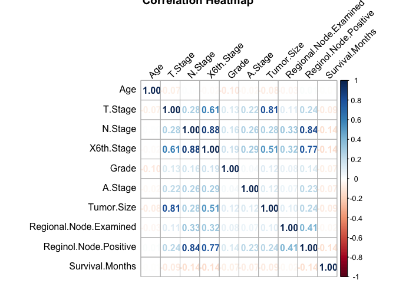
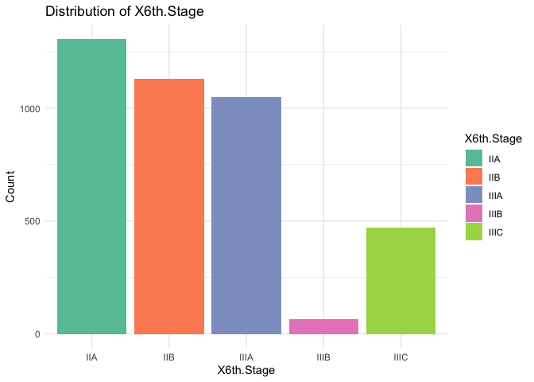
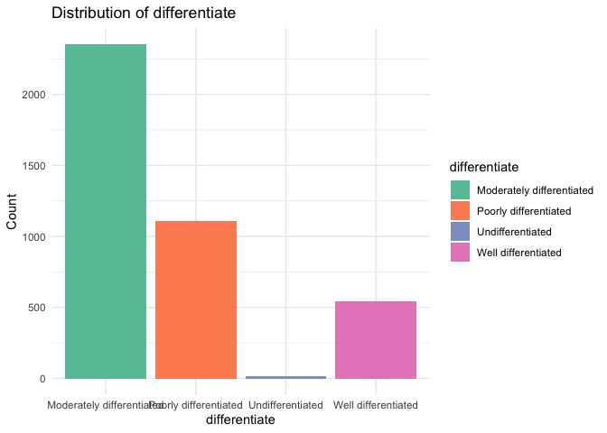
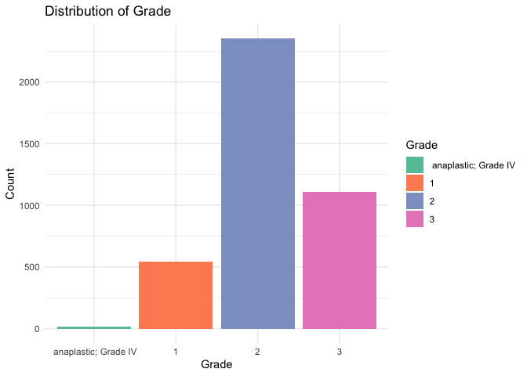
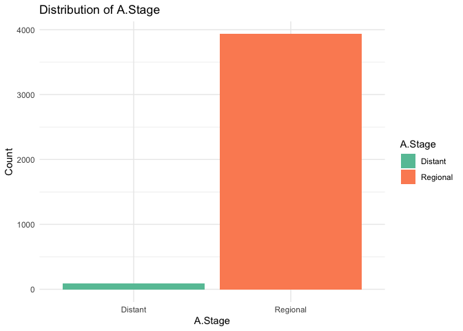

Breast cancer survival prediction
================
Tong Su
2024-12-19

``` r
# Load dataset
data <- read.csv("./data/Project_2_data.csv")

# Clean dataset
lapply(data, table)
```

    ## $Age
    ## 
    ##  30  31  32  33  34  35  36  37  38  39  40  41  42  43  44  45  46  47  48  49 
    ##   5  14  13  15  14  20  24  28  45  52  72  71  82  92  79 102 163 161 140 162 
    ##  50  51  52  53  54  55  56  57  58  59  60  61  62  63  64  65  66  67  68  69 
    ## 144 148 118 155 128 154 132 144 120 147 140 143 149 153 116 122 119 119 111 108 
    ## 
    ## $Race
    ## 
    ## Black Other White 
    ##   291   320  3413 
    ## 
    ## $Marital.Status
    ## 
    ##  Divorced   Married Separated   Single    Widowed 
    ##       486      2643        45       615       235 
    ## 
    ## $T.Stage
    ## 
    ##   T1   T2   T3   T4 
    ## 1603 1786  533  102 
    ## 
    ## $N.Stage
    ## 
    ##   N1   N2   N3 
    ## 2732  820  472 
    ## 
    ## $X6th.Stage
    ## 
    ##  IIA  IIB IIIA IIIB IIIC 
    ## 1305 1130 1050   67  472 
    ## 
    ## $differentiate
    ## 
    ## Moderately differentiated     Poorly differentiated          Undifferentiated 
    ##                      2351                      1111                        19 
    ##       Well differentiated 
    ##                       543 
    ## 
    ## $Grade
    ## 
    ##  anaplastic; Grade IV                     1                     2 
    ##                    19                   543                  2351 
    ##                     3 
    ##                  1111 
    ## 
    ## $A.Stage
    ## 
    ##  Distant Regional 
    ##       92     3932 
    ## 
    ## $Tumor.Size
    ## 
    ##   1   2   3   4   5   6   7   8   9  10  11  12  13  14  15  16  17  18  19  20 
    ##   7  12   9  14  25  23  42  40  49  92  77 118  81  92 271 104 120 158  75 211 
    ##  21  22  23  24  25  26  27  28  29  30  31  32  33  34  35  36  37  38  39  40 
    ## 108 115  78  69 268  42  61  57  22 228  28  50  25  24 161  17  26  28  10 145 
    ##  41  42  43  44  45  46  47  48  49  50  51  52  53  54  55  56  57  58  59  60 
    ##   6  28  10   8  77   9  16  12   3  93  21  20   5   6  64   5   7   6   4  92 
    ##  61  62  63  64  65  66  67  68  69  70  72  73  74  75  76  77  78  79  80  81 
    ##   7   7  10   1  29   3   1   7   2  61   5   1   5  24   5   2   3   1  46   2 
    ##  82  83  84  85  86  87  88  90  92  94  95  96  97  98 100 101 103 104 105 107 
    ##   3   3   2  10   1   1   1  27   2   1   5   1   2   1  25   2   1   1   3   1 
    ## 108 110 115 117 120 123 125 130 133 140 
    ##   1   4   1   1  15   1   1   5   1   5 
    ## 
    ## $Estrogen.Status
    ## 
    ## Negative Positive 
    ##      269     3755 
    ## 
    ## $Progesterone.Status
    ## 
    ## Negative Positive 
    ##      698     3326 
    ## 
    ## $Regional.Node.Examined
    ## 
    ##   1   2   3   4   5   6   7   8   9  10  11  12  13  14  15  16  17  18  19  20 
    ##  97 137 116 114 110 115 104 148 198 183 191 205 251 225 195 221 175 176 152 126 
    ##  21  22  23  24  25  26  27  28  29  30  31  32  33  34  35  36  37  38  39  40 
    ## 109  82  98  84  58  64  49  45  34  27  20  22  13   8  10   9   8   4   6   5 
    ##  41  42  43  44  45  46  47  49  51  52  54  57  60  61 
    ##   6   2   3   1   1   1   6   2   3   1   1   1   1   1 
    ## 
    ## $Reginol.Node.Positive
    ## 
    ##    1    2    3    4    5    6    7    8    9   10   11   12   13   14   15   16 
    ## 1522  740  420  261  207  140  108   75   90   61   56   50   33   41   26   29 
    ##   17   18   19   20   21   22   23   24   25   26   27   28   29   30   31   32 
    ##   26   15   23   10   13   16    8    8    3   10    6    7    6    2    1    2 
    ##   33   34   35   37   41   46 
    ##    2    2    1    2    1    1 
    ## 
    ## $Survival.Months
    ## 
    ##   1   2   3   4   5   6   7   8   9  10  11  12  13  14  15  16  17  18  19  20 
    ##   1   3   4  10   6   8   5   7   9   8   4   6  12  10   6   8   6  11   5  10 
    ##  21  22  23  24  25  26  27  28  29  30  31  32  33  34  35  36  37  38  39  40 
    ##   7  11  16  12  12   5  13   8   7  10  15   5   9  11  11  11  11  13   9  18 
    ##  41  42  43  44  45  46  47  48  49  50  51  52  53  54  55  56  57  58  59  60 
    ##  24  14  10  16  16  14  26  54  61  67  55  62  61  59  63  73  53  61  61  63 
    ##  61  62  63  64  65  66  67  68  69  70  71  72  73  74  75  76  77  78  79  80 
    ##  60  52  73  62  55  71  61  63  81  49  41  57  55  56  65  59  64  56  55  68 
    ##  81  82  83  84  85  86  87  88  89  90  91  92  93  94  95  96  97  98  99 100 
    ##  68  61  66  58  52  57  53  63  66  43  51  49  62  57  67  54  57  72  55  66 
    ## 101 102 103 104 105 106 107 
    ##  54  73  50  48  45  47  61 
    ## 
    ## $Status
    ## 
    ## Alive  Dead 
    ##  3408   616

``` r
data_cleaned <- data %>%
  mutate(
    Race = factor(Race),
    Marital.Status = factor(trimws(Marital.Status)),
    T.Stage = factor(T.Stage),
    N.Stage = factor(N.Stage),
    X6th.Stage = factor(X6th.Stage),
    differentiate = factor(differentiate),
    Grade = factor(trimws(Grade)),  # Trim spaces before factoring
    A.Stage = factor(A.Stage),
    Estrogen.Status = factor(Estrogen.Status),
    Progesterone.Status = factor(Progesterone.Status),
    Status = factor(Status)
  ) %>% 
  mutate(
    T.Stage = factor(T.Stage, levels = c("T1", "T2", "T3", "T4"), ordered = FALSE),
    N.Stage = factor(N.Stage, levels = c("N1", "N2", "N3"), ordered = FALSE),
    X6th.Stage = factor(X6th.Stage, levels = c("IIA", "IIB", "IIIA", "IIIB", "IIIC"), ordered = FALSE),
    Grade = factor(Grade, levels = c("1", "2", "3", "anaplastic; Grade IV"), ordered = FALSE),
    A.Stage = factor(A.Stage, levels = c("Regional", "Distant"), ordered = FALSE)
  ) %>% 
  select(-differentiate)
```

`Grade` and `differentiate` are redundant variables, so we drop
`differentiate`.

# 1. Descriptive Summary

``` r
# summary_stats for numeric predictors
summary_numeric <- data |> 
  select_if(is.numeric) |>
  summarise_all(list(
    mean = ~mean(.x, na.rm = TRUE), 
    median = ~median(.x, na.rm = TRUE), 
    sd = ~sd(.x, na.rm = TRUE),
    min = ~min(.x, na.rm = TRUE),
    max = ~max(.x, na.rm = TRUE),
    iqr = ~IQR(.x, na.rm = TRUE),
    count = ~sum(!is.na(.x))
  ))

summary_numeric_long <- summary_numeric |> 
  pivot_longer(
    cols = everything(),        
    names_to = c("Variable", "Statistic"), 
    names_sep = "_",            
    values_to = "Value"         
  )
summary_numeric_wide <- summary_numeric_long |> 
  pivot_wider(
    names_from = Statistic,    
    values_from = Value         
  )
summary_numeric_wide
```

    ## # A tibble: 5 × 8
    ##   Variable                mean median    sd   min   max   iqr count
    ##   <chr>                  <dbl>  <dbl> <dbl> <dbl> <dbl> <dbl> <dbl>
    ## 1 Age                    54.0      54  8.96    30    69    14  4024
    ## 2 Tumor.Size             30.5      25 21.1      1   140    22  4024
    ## 3 Regional.Node.Examined 14.4      14  8.10     1    61    10  4024
    ## 4 Reginol.Node.Positive   4.16      2  5.11     1    46     4  4024
    ## 5 Survival.Months        71.3      73 22.9      1   107    34  4024

``` r
#summary_stats for categorical predictors
summary_categorical <- data |> 
  select_if(is.character) |>   
  summarise_all(~ {
    freq_table <- table(.)
    summary <- paste(
      paste0(names(freq_table), " (", as.vector(freq_table), " - ", 
             round(prop.table(freq_table) * 100, 2), "%)"), 
      collapse = "; "
    )
    summary
  })

summary_categorical_long <- summary_categorical |> 
  pivot_longer(
    cols = everything(), 
    names_to = "Variable",
    values_to = "Summary"
  ) |> 
  unnest(Summary)

summary_categorical_long
```

    ## # A tibble: 11 × 2
    ##    Variable            Summary                                                  
    ##    <chr>               <chr>                                                    
    ##  1 Race                "Black (291 - 7.23%); Other (320 - 7.95%); White (3413 -…
    ##  2 Marital.Status      "Divorced (486 - 12.08%); Married (2643 - 65.68%); Separ…
    ##  3 T.Stage             "T1 (1603 - 39.84%); T2 (1786 - 44.38%); T3 (533 - 13.25…
    ##  4 N.Stage             "N1 (2732 - 67.89%); N2 (820 - 20.38%); N3 (472 - 11.73%…
    ##  5 X6th.Stage          "IIA (1305 - 32.43%); IIB (1130 - 28.08%); IIIA (1050 - …
    ##  6 differentiate       "Moderately differentiated (2351 - 58.42%); Poorly diffe…
    ##  7 Grade               " anaplastic; Grade IV (19 - 0.47%); 1 (543 - 13.49%); 2…
    ##  8 A.Stage             "Distant (92 - 2.29%); Regional (3932 - 97.71%)"         
    ##  9 Estrogen.Status     "Negative (269 - 6.68%); Positive (3755 - 93.32%)"       
    ## 10 Progesterone.Status "Negative (698 - 17.35%); Positive (3326 - 82.65%)"      
    ## 11 Status              "Alive (3408 - 84.69%); Dead (616 - 15.31%)"

``` r
# Missing data
missing_percentage <- data |> 
  summarise(across(everything(), ~ mean(is.na(.)) * 100, .names = "missing_pct_{.col}"))
missing_percentage
```

    ##   missing_pct_Age missing_pct_Race missing_pct_Marital.Status
    ## 1               0                0                          0
    ##   missing_pct_T.Stage missing_pct_N.Stage missing_pct_X6th.Stage
    ## 1                   0                   0                      0
    ##   missing_pct_differentiate missing_pct_Grade missing_pct_A.Stage
    ## 1                         0                 0                   0
    ##   missing_pct_Tumor.Size missing_pct_Estrogen.Status
    ## 1                      0                           0
    ##   missing_pct_Progesterone.Status missing_pct_Regional.Node.Examined
    ## 1                               0                                  0
    ##   missing_pct_Reginol.Node.Positive missing_pct_Survival.Months
    ## 1                                 0                           0
    ##   missing_pct_Status
    ## 1                  0

# 2. Data Visualization

``` r
# Distribution of continuous variables
numeric_vars <- data |> select_if(is.numeric)

# Histogram for continuous variables
for (col in names(numeric_vars)) {
  ggplot(data, aes_string(x = col)) +
    geom_histogram(bins = 30, fill = "blue", color = "black") +
    ggtitle(paste("Distribution of", col)) +
    theme_minimal()
}
```

    ## Warning: `aes_string()` was deprecated in ggplot2 3.0.0.
    ## ℹ Please use tidy evaluation idioms with `aes()`.
    ## ℹ See also `vignette("ggplot2-in-packages")` for more information.
    ## This warning is displayed once every 8 hours.
    ## Call `lifecycle::last_lifecycle_warnings()` to see where this warning was
    ## generated.

``` r
# Scatter plot for continuous variables
predictors = c("Age", "Tumor.Size", "Regional.Node.Examined", "Reginol.Node.Positive")
sorted_data = melt(data, id.vars = "Survival.Months", measure.vars = predictors)
ggplot(sorted_data, aes(x = value, y = Survival.Months)) +
  geom_point(alpha = 1) +
  geom_smooth(method = "lm", color = "blue") +
  facet_wrap(~variable, scales = "free_x") +  
  labs(title = "Scatter Plots of Predictors vs Survival Time",
       x = "Predictor Value",
       y = "Survival Time (Months)") +
  theme_minimal()
```

    ## `geom_smooth()` using formula = 'y ~ x'

<!-- -->

``` r
# Correlation heatmap
cor_matrix <- cor(numeric_vars, use = "complete.obs")
ggplot(melt(cor_matrix), aes(Var1, Var2, fill = value)) + 
  geom_tile() + 
  scale_fill_gradient2() + 
  ggtitle("Correlation Heatmap") + 
  theme_minimal()
```

<!-- -->

``` r
# Correlation heatmap with correlation coefficient
corrplot(cor_matrix, method = "number", type = "full", tl.col = "black", tl.srt = 45, title = "Correlation Heatmap")
```

<!-- -->

``` r
# Bar Plot for categorical variables
categorical_vars <- names(data)[sapply(data, is.factor) | sapply(data, is.character)]
if (length(categorical_vars) > 0) {
  for (var in categorical_vars) {
    p <- ggplot(data, aes_string(x = var, fill = var)) +
      geom_bar() +
      labs(
        title = paste("Distribution of", var),
        x = var,
        y = "Count"
      ) +
      theme_minimal() +
      scale_fill_brewer(palette = "Set2")  
    
    print(p)  
  }
} else {
  message("No categorical variables found in the dataset.")
}
```

<!-- --><!-- --><!-- --><!-- --><!-- --><!-- --><!-- --><!-- --><!-- --><!-- --><!-- -->

# 3. Model Building: Survival Analysis

``` r
# Convert Status to binary (Dead = 1, Alive = 0)
data$Status <- ifelse(data$Status == "Dead", 1, 0)

# Build Cox Proportional Hazards model
cox_model <- coxph(Surv(Survival.Months, Status) ~ ., data = data)
summary(cox_model)
```

    ## Call:
    ## coxph(formula = Surv(Survival.Months, Status) ~ ., data = data)
    ## 
    ##   n= 4024, number of events= 616 
    ## 
    ##                                         coef exp(coef)  se(coef)      z
    ## Age                                 0.020463  1.020673  0.004873  4.200
    ## RaceOther                          -0.736866  0.478612  0.214042 -3.443
    ## RaceWhite                          -0.370655  0.690282  0.129776 -2.856
    ## Marital.StatusMarried              -0.203376  0.815971  0.119228 -1.706
    ## Marital.StatusSeparated             0.391784  1.479619  0.290182  1.350
    ## Marital.StatusSingle               -0.030024  0.970422  0.146084 -0.206
    ## Marital.StatusWidowed              -0.030182  0.970269  0.181574 -0.166
    ## T.StageT2                           0.201182  1.222847  0.160641  1.252
    ## T.StageT3                           0.354265  1.425133  0.253364  1.398
    ## T.StageT4                           0.637921  1.892542  0.313356  2.036
    ## N.StageN2                           0.568511  1.765636  0.203140  2.799
    ## N.StageN3                           0.756433  2.130663  0.240152  3.150
    ## X6th.StageIIB                       0.269771  1.309664  0.201799  1.337
    ## X6th.StageIIIA                      0.027973  1.028368  0.254824  0.110
    ## X6th.StageIIIB                      0.202537  1.224505  0.395992  0.511
    ## X6th.StageIIIC                            NA        NA  0.000000     NA
    ## differentiatePoorly differentiated  0.351803  1.421629  0.089308  3.939
    ## differentiateUndifferentiated       1.104912  3.018960  0.349828  3.158
    ## differentiateWell differentiated   -0.449352  0.638042  0.171180 -2.625
    ## Grade1                                    NA        NA  0.000000     NA
    ## Grade2                                    NA        NA  0.000000     NA
    ## Grade3                                    NA        NA  0.000000     NA
    ## A.StageRegional                    -0.150448  0.860322  0.194018 -0.775
    ## Tumor.Size                          0.001680  1.001681  0.003161  0.531
    ## Estrogen.StatusPositive            -0.648532  0.522813  0.135622 -4.782
    ## Progesterone.StatusPositive        -0.486487  0.614782  0.106949 -4.549
    ## Regional.Node.Examined             -0.033013  0.967526  0.006492 -5.085
    ## Reginol.Node.Positive               0.058490  1.060234  0.011353  5.152
    ##                                    Pr(>|z|)    
    ## Age                                2.67e-05 ***
    ## RaceOther                          0.000576 ***
    ## RaceWhite                          0.004289 ** 
    ## Marital.StatusMarried              0.088051 .  
    ## Marital.StatusSeparated            0.176973    
    ## Marital.StatusSingle               0.837162    
    ## Marital.StatusWidowed              0.867980    
    ## T.StageT2                          0.210435    
    ## T.StageT3                          0.162038    
    ## T.StageT4                          0.041773 *  
    ## N.StageN2                          0.005132 ** 
    ## N.StageN3                          0.001634 ** 
    ## X6th.StageIIB                      0.181279    
    ## X6th.StageIIIA                     0.912589    
    ## X6th.StageIIIB                     0.609025    
    ## X6th.StageIIIC                           NA    
    ## differentiatePoorly differentiated 8.18e-05 ***
    ## differentiateUndifferentiated      0.001586 ** 
    ## differentiateWell differentiated   0.008664 ** 
    ## Grade1                                   NA    
    ## Grade2                                   NA    
    ## Grade3                                   NA    
    ## A.StageRegional                    0.438084    
    ## Tumor.Size                         0.595099    
    ## Estrogen.StatusPositive            1.74e-06 ***
    ## Progesterone.StatusPositive        5.40e-06 ***
    ## Regional.Node.Examined             3.67e-07 ***
    ## Reginol.Node.Positive              2.58e-07 ***
    ## ---
    ## Signif. codes:  0 '***' 0.001 '**' 0.01 '*' 0.05 '.' 0.1 ' ' 1
    ## 
    ##                                    exp(coef) exp(-coef) lower .95 upper .95
    ## Age                                   1.0207     0.9797    1.0110    1.0305
    ## RaceOther                             0.4786     2.0894    0.3146    0.7281
    ## RaceWhite                             0.6903     1.4487    0.5353    0.8902
    ## Marital.StatusMarried                 0.8160     1.2255    0.6459    1.0308
    ## Marital.StatusSeparated               1.4796     0.6758    0.8378    2.6131
    ## Marital.StatusSingle                  0.9704     1.0305    0.7288    1.2921
    ## Marital.StatusWidowed                 0.9703     1.0306    0.6797    1.3850
    ## T.StageT2                             1.2228     0.8178    0.8926    1.6754
    ## T.StageT3                             1.4251     0.7017    0.8673    2.3416
    ## T.StageT4                             1.8925     0.5284    1.0240    3.4976
    ## N.StageN2                             1.7656     0.5664    1.1857    2.6291
    ## N.StageN3                             2.1307     0.4693    1.3308    3.4114
    ## X6th.StageIIB                         1.3097     0.7636    0.8818    1.9451
    ## X6th.StageIIIA                        1.0284     0.9724    0.6241    1.6946
    ## X6th.StageIIIB                        1.2245     0.8167    0.5635    2.6609
    ## X6th.StageIIIC                            NA         NA        NA        NA
    ## differentiatePoorly differentiated    1.4216     0.7034    1.1933    1.6936
    ## differentiateUndifferentiated         3.0190     0.3312    1.5208    5.9928
    ## differentiateWell differentiated      0.6380     1.5673    0.4562    0.8924
    ## Grade1                                    NA         NA        NA        NA
    ## Grade2                                    NA         NA        NA        NA
    ## Grade3                                    NA         NA        NA        NA
    ## A.StageRegional                       0.8603     1.1624    0.5882    1.2584
    ## Tumor.Size                            1.0017     0.9983    0.9955    1.0079
    ## Estrogen.StatusPositive               0.5228     1.9127    0.4008    0.6820
    ## Progesterone.StatusPositive           0.6148     1.6266    0.4985    0.7582
    ## Regional.Node.Examined                0.9675     1.0336    0.9553    0.9799
    ## Reginol.Node.Positive                 1.0602     0.9432    1.0369    1.0841
    ## 
    ## Concordance= 0.744  (se = 0.011 )
    ## Likelihood ratio test= 501.6  on 24 df,   p=<2e-16
    ## Wald test            = 570.2  on 24 df,   p=<2e-16
    ## Score (logrank) test = 665  on 24 df,   p=<2e-16

``` r
# Save model summary
tidy_cox <- broom::tidy(cox_model)
write.csv(tidy_cox, "cox_model_summary.csv")

# Evaluate Model Performance
# Concordance index
c_index <- summary(cox_model)$concordance
cat("Concordance Index:", c_index, "\n")
```

    ## Concordance Index: 0.7437448 0.01069854

# 4. Model Building: Logistic Regression

# Model Diagnostics

``` r
logistic <- glm(Status ~ ., family = binomial, data = data)
# alias_info <- alias(logistic)
# print(alias_info)
# logit_vif_values <- vif(logistic)
# print(logit_vif_values)
```

## Varibales selection

``` r
# backward selection
backward_model <- step(logistic, direction = "backward")
```

    ## Start:  AIC=2284.41
    ## Status ~ Age + Race + Marital.Status + T.Stage + N.Stage + X6th.Stage + 
    ##     differentiate + Grade + A.Stage + Tumor.Size + Estrogen.Status + 
    ##     Progesterone.Status + Regional.Node.Examined + Reginol.Node.Positive + 
    ##     Survival.Months
    ## 
    ## 
    ## Step:  AIC=2284.41
    ## Status ~ Age + Race + Marital.Status + T.Stage + N.Stage + X6th.Stage + 
    ##     differentiate + A.Stage + Tumor.Size + Estrogen.Status + 
    ##     Progesterone.Status + Regional.Node.Examined + Reginol.Node.Positive + 
    ##     Survival.Months
    ## 
    ##                          Df Deviance    AIC
    ## - Marital.Status          4   2235.7 2279.7
    ## - X6th.Stage              3   2235.1 2281.1
    ## - A.Stage                 1   2232.7 2282.7
    ## - Tumor.Size              1   2232.9 2282.9
    ## <none>                        2232.4 2284.4
    ## - Estrogen.Status         1   2235.1 2285.1
    ## - T.Stage                 3   2239.6 2285.6
    ## - N.Stage                 1   2238.9 2288.9
    ## - Race                    2   2242.1 2290.1
    ## - Progesterone.Status     1   2243.7 2293.7
    ## - Regional.Node.Examined  1   2248.2 2298.2
    ## - Reginol.Node.Positive   1   2251.2 2301.2
    ## - Age                     1   2251.6 2301.6
    ## - differentiate           3   2262.8 2308.8
    ## - Survival.Months         1   2952.0 3002.0
    ## 
    ## Step:  AIC=2279.72
    ## Status ~ Age + Race + T.Stage + N.Stage + X6th.Stage + differentiate + 
    ##     A.Stage + Tumor.Size + Estrogen.Status + Progesterone.Status + 
    ##     Regional.Node.Examined + Reginol.Node.Positive + Survival.Months
    ## 
    ##                          Df Deviance    AIC
    ## - X6th.Stage              3   2238.3 2276.3
    ## - A.Stage                 1   2236.0 2278.0
    ## - Tumor.Size              1   2236.1 2278.1
    ## <none>                        2235.7 2279.7
    ## - Estrogen.Status         1   2238.4 2280.4
    ## - T.Stage                 3   2242.9 2280.9
    ## - N.Stage                 1   2242.1 2284.1
    ## - Race                    2   2246.6 2286.6
    ## - Progesterone.Status     1   2247.6 2289.6
    ## - Regional.Node.Examined  1   2251.5 2293.5
    ## - Reginol.Node.Positive   1   2254.9 2296.9
    ## - Age                     1   2257.3 2299.3
    ## - differentiate           3   2265.8 2303.8
    ## - Survival.Months         1   2960.1 3002.1
    ## 
    ## Step:  AIC=2276.32
    ## Status ~ Age + Race + T.Stage + N.Stage + differentiate + A.Stage + 
    ##     Tumor.Size + Estrogen.Status + Progesterone.Status + Regional.Node.Examined + 
    ##     Reginol.Node.Positive + Survival.Months
    ## 
    ##                          Df Deviance    AIC
    ## - A.Stage                 1   2238.6 2274.6
    ## - Tumor.Size              1   2238.6 2274.6
    ## <none>                        2238.3 2276.3
    ## - Estrogen.Status         1   2241.1 2277.1
    ## - N.Stage                 2   2245.6 2279.6
    ## - Race                    2   2249.8 2283.8
    ## - Progesterone.Status     1   2250.0 2286.0
    ## - T.Stage                 3   2254.2 2286.2
    ## - Regional.Node.Examined  1   2254.1 2290.1
    ## - Reginol.Node.Positive   1   2257.8 2293.8
    ## - Age                     1   2259.0 2295.0
    ## - differentiate           3   2268.2 2300.2
    ## - Survival.Months         1   2961.7 2997.7
    ## 
    ## Step:  AIC=2274.59
    ## Status ~ Age + Race + T.Stage + N.Stage + differentiate + Tumor.Size + 
    ##     Estrogen.Status + Progesterone.Status + Regional.Node.Examined + 
    ##     Reginol.Node.Positive + Survival.Months
    ## 
    ##                          Df Deviance    AIC
    ## - Tumor.Size              1   2238.9 2272.9
    ## <none>                        2238.6 2274.6
    ## - Estrogen.Status         1   2241.4 2275.4
    ## - N.Stage                 2   2245.7 2277.7
    ## - Race                    2   2250.2 2282.2
    ## - Progesterone.Status     1   2250.3 2284.3
    ## - T.Stage                 3   2254.3 2284.3
    ## - Regional.Node.Examined  1   2254.2 2288.2
    ## - Reginol.Node.Positive   1   2258.3 2292.3
    ## - Age                     1   2259.6 2293.6
    ## - differentiate           3   2268.8 2298.8
    ## - Survival.Months         1   2961.8 2995.8
    ## 
    ## Step:  AIC=2272.88
    ## Status ~ Age + Race + T.Stage + N.Stage + differentiate + Estrogen.Status + 
    ##     Progesterone.Status + Regional.Node.Examined + Reginol.Node.Positive + 
    ##     Survival.Months
    ## 
    ##                          Df Deviance    AIC
    ## <none>                        2238.9 2272.9
    ## - Estrogen.Status         1   2241.6 2273.6
    ## - N.Stage                 2   2245.8 2275.8
    ## - Race                    2   2250.4 2280.4
    ## - Progesterone.Status     1   2250.7 2282.7
    ## - Regional.Node.Examined  1   2254.4 2286.4
    ## - T.Stage                 3   2261.7 2289.7
    ## - Reginol.Node.Positive   1   2258.5 2290.5
    ## - Age                     1   2260.1 2292.1
    ## - differentiate           3   2269.2 2297.2
    ## - Survival.Months         1   2961.8 2993.8

``` r
AIC(backward_model)
```

    ## [1] 2272.878

``` r
# forward selection
null_logistic <- glm(Status ~ 1, family = binomial, data = data)
forward_model <- step(null_logistic, direction = "forward")
```

    ## Start:  AIC=3446.68
    ## Status ~ 1

``` r
AIC(forward_model)
```

    ## [1] 3446.683

# 4. Fairness Analysis
