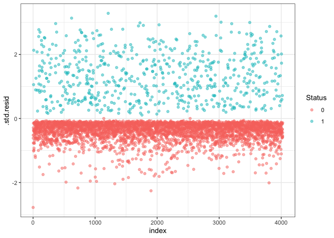

Breast cancer survival prediction
================
Tong Su, Minghe Wang, Kai Tan, Yifei Chen
2024-12-19

``` r
# Load dataset
data <- read.csv("./data/Project_2_data.csv")

# Clean dataset
data_cleaned <- data %>%
  mutate(
    Race = factor(Race),
    Marital.Status = factor(trimws(Marital.Status)),
    T.Stage = factor(T.Stage),
    N.Stage = factor(N.Stage),
    X6th.Stage = factor(X6th.Stage),
    differentiate = factor(differentiate),
    Grade = factor(trimws(Grade)),  # Trim spaces before factoring
    A.Stage = factor(A.Stage),
    Estrogen.Status = factor(Estrogen.Status),
    Progesterone.Status = factor(Progesterone.Status),
    Status = ifelse(Status == "Dead", 1, 0)
  ) %>% 
  mutate(
    T.Stage = as.numeric(factor(T.Stage, levels = c("T1", "T2", "T3", "T4"), ordered = TRUE)),
    N.Stage = as.numeric(factor(N.Stage, levels = c("N1", "N2", "N3"), ordered = TRUE)),
    X6th.Stage = as.numeric(factor(X6th.Stage, levels = c("IIA", "IIB", "IIIA", "IIIB", "IIIC"), ordered = TRUE)),
    Grade = as.numeric(factor(Grade, levels = c("1", "2", "3", "anaplastic; Grade IV"), ordered = TRUE)),
    A.Stage = as.numeric(factor(A.Stage, levels = c("Regional", "Distant"), ordered = TRUE))
  ) %>% 
  select(-differentiate)
```

`Grade` and `differentiate` are redundant variables, so we drop
`differentiate`.

# 1. Descriptive Summary

``` r
# summary_stats for numeric predictors
summary_numeric <- data_cleaned |> 
  select_if(is.numeric) |>
  summarise_all(list(
    mean = ~mean(.x, na.rm = TRUE), 
    median = ~median(.x, na.rm = TRUE), 
    sd = ~sd(.x, na.rm = TRUE),
    min = ~min(.x, na.rm = TRUE),
    max = ~max(.x, na.rm = TRUE),
    iqr = ~IQR(.x, na.rm = TRUE),
    count = ~sum(!is.na(.x))
  ))

summary_numeric_long <- summary_numeric |> 
  pivot_longer(
    cols = everything(),        
    names_to = c("Variable", "Statistic"), 
    names_sep = "_",            
    values_to = "Value"         
  )
summary_numeric_wide <- summary_numeric_long |> 
  pivot_wider(
    names_from = Statistic,    
    values_from = Value         
  )
summary_numeric_wide
```

    ## # A tibble: 11 × 8
    ##    Variable                 mean median     sd   min   max   iqr count
    ##    <chr>                   <dbl>  <dbl>  <dbl> <dbl> <dbl> <dbl> <dbl>
    ##  1 Age                    54.0       54  8.96     30    69    14  4024
    ##  2 T.Stage                 1.78       2  0.766     1     4     1  4024
    ##  3 N.Stage                 1.44       1  0.693     1     3     1  4024
    ##  4 X6th.Stage              2.32       2  1.27      1     5     2  4024
    ##  5 Grade                   2.15       2  0.638     1     4     1  4024
    ##  6 A.Stage                 1.02       1  0.149     1     2     0  4024
    ##  7 Tumor.Size             30.5       25 21.1       1   140    22  4024
    ##  8 Regional.Node.Examined 14.4       14  8.10      1    61    10  4024
    ##  9 Reginol.Node.Positive   4.16       2  5.11      1    46     4  4024
    ## 10 Survival.Months        71.3       73 22.9       1   107    34  4024
    ## 11 Status                  0.153      0  0.360     0     1     0  4024

``` r
# Missing data
missing_percentage <- data_cleaned |> 
  summarise(across(everything(), ~ mean(is.na(.)) * 100, .names = "missing_pct_{.col}"))
missing_percentage
```

    ##   missing_pct_Age missing_pct_Race missing_pct_Marital.Status
    ## 1               0                0                          0
    ##   missing_pct_T.Stage missing_pct_N.Stage missing_pct_X6th.Stage
    ## 1                   0                   0                      0
    ##   missing_pct_Grade missing_pct_A.Stage missing_pct_Tumor.Size
    ## 1                 0                   0                      0
    ##   missing_pct_Estrogen.Status missing_pct_Progesterone.Status
    ## 1                           0                               0
    ##   missing_pct_Regional.Node.Examined missing_pct_Reginol.Node.Positive
    ## 1                                  0                                 0
    ##   missing_pct_Survival.Months missing_pct_Status
    ## 1                           0                  0

# 2. Data Visualization

``` r
# Distribution of continuous variables
numeric_vars <- data_cleaned |> select_if(is.numeric)

# Histogram for continuous variables
for (col in names(numeric_vars)) {
  ggplot(data_cleaned, aes_string(x = col)) +
    geom_histogram(bins = 30, fill = "blue", color = "black") +
    ggtitle(paste("Distribution of", col)) +
    theme_minimal()
}
```

    ## Warning: `aes_string()` was deprecated in ggplot2 3.0.0.
    ## ℹ Please use tidy evaluation idioms with `aes()`.
    ## ℹ See also `vignette("ggplot2-in-packages")` for more information.
    ## This warning is displayed once every 8 hours.
    ## Call `lifecycle::last_lifecycle_warnings()` to see where this warning was
    ## generated.

``` r
# Scatter plot for continuous variables
predictors = c("Age", "Tumor.Size", "Regional.Node.Examined", "Reginol.Node.Positive")
sorted_data = melt(data_cleaned, id.vars = "Survival.Months", measure.vars = predictors)
ggplot(sorted_data, aes(x = value, y = Survival.Months)) +
  geom_point(alpha = 1) +
  geom_smooth(method = "lm", color = "blue") +
  facet_wrap(~variable, scales = "free_x") +  
  labs(title = "Scatter Plots of Predictors vs Survival Time",
       x = "Predictor Value",
       y = "Survival Time (Months)") +
  theme_minimal()
```

    ## `geom_smooth()` using formula = 'y ~ x'

<!-- -->

``` r
# Correlation heatmap with correlation coefficient
cor_matrix <- cor(numeric_vars, use = "complete.obs")
corrplot(cor_matrix, method = "number", type = "full", tl.col = "black", tl.srt = 45, title = "Correlation Heatmap")
```

<!-- -->

``` r
# Bar Plot for categorical variables
categorical_vars <- names(data_cleaned)[sapply(data_cleaned, is.factor) | sapply(data_cleaned, is.character)]
if (length(categorical_vars) > 0) {
  for (var in categorical_vars) {
    p <- ggplot(data_cleaned, aes_string(x = var, fill = var)) +
      geom_bar() +
      labs(
        title = paste("Distribution of", var),
        x = var,
        y = "Count"
      ) +
      theme_minimal() +
      scale_fill_brewer(palette = "Set2")  
    
    print(p)  
  }
} else {
  message("No categorical variables found in the dataset.")
}
```

<!-- --><!-- --><!-- --><!-- -->

``` r
#show pairs with strong correlation
for (i in 1:(nrow(cor_matrix) - 1)) {
  for (j in (i + 1):ncol(cor_matrix)) {
    if (abs(cor_matrix[i, j]) > 0.7) {
      cat("Pairs with strong correlation:", rownames(cor_matrix)[i], "~", colnames(cor_matrix)[j], 
          "with correlation =", cor_matrix[i, j], "\n")
    }
  }
}
```

    ## Pairs with strong correlation: T.Stage ~ Tumor.Size with correlation = 0.8091755 
    ## Pairs with strong correlation: N.Stage ~ X6th.Stage with correlation = 0.8818801 
    ## Pairs with strong correlation: N.Stage ~ Reginol.Node.Positive with correlation = 0.8380733 
    ## Pairs with strong correlation: X6th.Stage ~ Reginol.Node.Positive with correlation = 0.7739631

``` r
#show pairs with weak correlation
for (i in 1:(nrow(cor_matrix) - 1)) {
  for (j in (i + 1):ncol(cor_matrix)) {
    if (abs(cor_matrix[i, j]) > 0.2 & abs(cor_matrix[i, j]) < 0.4) {
      cat("Pairs with weak correlation:", rownames(cor_matrix)[i], "~", colnames(cor_matrix)[j], 
          "with correlation =", cor_matrix[i, j], "\n")
    }
  }
}
```

    ## Pairs with weak correlation: T.Stage ~ N.Stage with correlation = 0.2770145 
    ## Pairs with weak correlation: T.Stage ~ A.Stage with correlation = 0.2211235 
    ## Pairs with weak correlation: T.Stage ~ Reginol.Node.Positive with correlation = 0.2430749 
    ## Pairs with weak correlation: N.Stage ~ A.Stage with correlation = 0.2605729 
    ## Pairs with weak correlation: N.Stage ~ Tumor.Size with correlation = 0.2779047 
    ## Pairs with weak correlation: N.Stage ~ Regional.Node.Examined with correlation = 0.3282761 
    ## Pairs with weak correlation: N.Stage ~ Status with correlation = 0.2557719 
    ## Pairs with weak correlation: X6th.Stage ~ A.Stage with correlation = 0.2919618 
    ## Pairs with weak correlation: X6th.Stage ~ Regional.Node.Examined with correlation = 0.3172187 
    ## Pairs with weak correlation: X6th.Stage ~ Status with correlation = 0.2576359 
    ## Pairs with weak correlation: A.Stage ~ Reginol.Node.Positive with correlation = 0.2328489 
    ## Pairs with weak correlation: Tumor.Size ~ Reginol.Node.Positive with correlation = 0.2423217 
    ## Pairs with weak correlation: Reginol.Node.Positive ~ Status with correlation = 0.2566381

# 3. Model Building: Survival Analysis

``` r
# Build Cox Proportional Hazards model
cox_model <- coxph(Surv(Survival.Months, Status) ~ ., data = data_cleaned)
summary(cox_model)
```

    ## Call:
    ## coxph(formula = Surv(Survival.Months, Status) ~ ., data = data_cleaned)
    ## 
    ##   n= 4024, number of events= 616 
    ## 
    ##                                   coef  exp(coef)   se(coef)      z Pr(>|z|)
    ## Age                          0.0203770  1.0205860  0.0048613  4.192 2.77e-05
    ## RaceOther                   -0.7368944  0.4785979  0.2134615 -3.452 0.000556
    ## RaceWhite                   -0.3744974  0.6876348  0.1293944 -2.894 0.003801
    ## Marital.StatusMarried       -0.1991172  0.8194539  0.1190045 -1.673 0.094290
    ## Marital.StatusSeparated      0.4384181  1.5502529  0.2878537  1.523 0.127744
    ## Marital.StatusSingle        -0.0111130  0.9889485  0.1456421 -0.076 0.939177
    ## Marital.StatusWidowed       -0.0380960  0.9626205  0.1810814 -0.210 0.833371
    ## T.Stage                      0.2826774  1.3266771  0.0927377  3.048 0.002303
    ## N.Stage                      0.3475721  1.4156264  0.1554043  2.237 0.025315
    ## X6th.Stage                  -0.0038128  0.9961945  0.1001211 -0.038 0.969622
    ## Grade                        0.3943812  1.4834659  0.0684734  5.760 8.43e-09
    ## A.Stage                      0.1219854  1.1297376  0.1861550  0.655 0.512282
    ## Tumor.Size                  -0.0002408  0.9997592  0.0026804 -0.090 0.928422
    ## Estrogen.StatusPositive     -0.6544763  0.5197142  0.1348804 -4.852 1.22e-06
    ## Progesterone.StatusPositive -0.4701143  0.6249308  0.1064462 -4.416 1.00e-05
    ## Regional.Node.Examined      -0.0323493  0.9681683  0.0064298 -5.031 4.88e-07
    ## Reginol.Node.Positive        0.0535131  1.0549708  0.0109855  4.871 1.11e-06
    ##                                
    ## Age                         ***
    ## RaceOther                   ***
    ## RaceWhite                   ** 
    ## Marital.StatusMarried       .  
    ## Marital.StatusSeparated        
    ## Marital.StatusSingle           
    ## Marital.StatusWidowed          
    ## T.Stage                     ** 
    ## N.Stage                     *  
    ## X6th.Stage                     
    ## Grade                       ***
    ## A.Stage                        
    ## Tumor.Size                     
    ## Estrogen.StatusPositive     ***
    ## Progesterone.StatusPositive ***
    ## Regional.Node.Examined      ***
    ## Reginol.Node.Positive       ***
    ## ---
    ## Signif. codes:  0 '***' 0.001 '**' 0.01 '*' 0.05 '.' 0.1 ' ' 1
    ## 
    ##                             exp(coef) exp(-coef) lower .95 upper .95
    ## Age                            1.0206     0.9798    1.0109    1.0304
    ## RaceOther                      0.4786     2.0894    0.3150    0.7272
    ## RaceWhite                      0.6876     1.4543    0.5336    0.8861
    ## Marital.StatusMarried          0.8195     1.2203    0.6490    1.0347
    ## Marital.StatusSeparated        1.5503     0.6451    0.8818    2.7254
    ## Marital.StatusSingle           0.9889     1.0112    0.7434    1.3157
    ## Marital.StatusWidowed          0.9626     1.0388    0.6750    1.3728
    ## T.Stage                        1.3267     0.7538    1.1062    1.5911
    ## N.Stage                        1.4156     0.7064    1.0439    1.9197
    ## X6th.Stage                     0.9962     1.0038    0.8187    1.2122
    ## Grade                          1.4835     0.6741    1.2972    1.6965
    ## A.Stage                        1.1297     0.8852    0.7844    1.6272
    ## Tumor.Size                     0.9998     1.0002    0.9945    1.0050
    ## Estrogen.StatusPositive        0.5197     1.9241    0.3990    0.6770
    ## Progesterone.StatusPositive    0.6249     1.6002    0.5073    0.7699
    ## Regional.Node.Examined         0.9682     1.0329    0.9560    0.9804
    ## Reginol.Node.Positive          1.0550     0.9479    1.0325    1.0779
    ## 
    ## Concordance= 0.743  (se = 0.011 )
    ## Likelihood ratio test= 493.1  on 17 df,   p=<2e-16
    ## Wald test            = 575.7  on 17 df,   p=<2e-16
    ## Score (logrank) test = 648.5  on 17 df,   p=<2e-16

``` r
# Save model summary
tidy_cox <- broom::tidy(cox_model)
write.csv(tidy_cox, "cox_model_summary.csv")

# Evaluate Model Performance
# Concordance index
c_index <- summary(cox_model)$concordance
cat("Concordance Index:", c_index, "\n")
```

    ## Concordance Index: 0.7434161 0.01067736

## Model Diagnositics

``` r
cox_zph <- cox.zph(cox_model)
print(cox_zph)
```

    ##                           chisq df       p
    ## Age                     0.10103  1   0.751
    ## Race                    0.99407  2   0.608
    ## Marital.Status          2.52774  4   0.640
    ## T.Stage                 0.00271  1   0.959
    ## N.Stage                 0.79775  1   0.372
    ## X6th.Stage              0.35537  1   0.551
    ## Grade                   1.88411  1   0.170
    ## A.Stage                 5.52961  1   0.019
    ## Tumor.Size              0.97769  1   0.323
    ## Estrogen.Status        29.60558  1 5.3e-08
    ## Progesterone.Status    32.46468  1 1.2e-08
    ## Regional.Node.Examined  0.01050  1   0.918
    ## Reginol.Node.Positive   0.02145  1   0.884
    ## GLOBAL                 55.54616 17 5.6e-06

``` r
# Fit Cox model with stratification on violating covariates
cox_model_strat <- coxph(Surv(Survival.Months, Status) ~ Age + Race + Marital.Status + T.Stage + 
                          N.Stage + X6th.Stage + Grade + Tumor.Size + 
                          Regional.Node.Examined + Reginol.Node.Positive + 
                          strata(A.Stage) + strata(Estrogen.Status) + 
                          strata(Progesterone.Status), 
                        data = data_cleaned)

summary(cox_model_strat)
```

    ## Call:
    ## coxph(formula = Surv(Survival.Months, Status) ~ Age + Race + 
    ##     Marital.Status + T.Stage + N.Stage + X6th.Stage + Grade + 
    ##     Tumor.Size + Regional.Node.Examined + Reginol.Node.Positive + 
    ##     strata(A.Stage) + strata(Estrogen.Status) + strata(Progesterone.Status), 
    ##     data = data_cleaned)
    ## 
    ##   n= 4024, number of events= 616 
    ## 
    ##                               coef  exp(coef)   se(coef)      z Pr(>|z|)    
    ## Age                      0.0202369  1.0204430  0.0048649  4.160 3.19e-05 ***
    ## RaceOther               -0.7467612  0.4738990  0.2133503 -3.500 0.000465 ***
    ## RaceWhite               -0.3745104  0.6876258  0.1291795 -2.899 0.003742 ** 
    ## Marital.StatusMarried   -0.1927006  0.8247289  0.1191009 -1.618 0.105671    
    ## Marital.StatusSeparated  0.3660085  1.4419674  0.2906047  1.259 0.207860    
    ## Marital.StatusSingle    -0.0164929  0.9836424  0.1458465 -0.113 0.909964    
    ## Marital.StatusWidowed   -0.0400914  0.9607017  0.1817133 -0.221 0.825381    
    ## T.Stage                  0.2857357  1.3307407  0.0923058  3.096 0.001965 ** 
    ## N.Stage                  0.3453182  1.4124393  0.1571581  2.197 0.028001 *  
    ## X6th.Stage               0.0076886  1.0077182  0.1009082  0.076 0.939265    
    ## Grade                    0.3942280  1.4832388  0.0687292  5.736 9.70e-09 ***
    ## Tumor.Size              -0.0008377  0.9991627  0.0026999 -0.310 0.756370    
    ## Regional.Node.Examined  -0.0315417  0.9689505  0.0064293 -4.906 9.30e-07 ***
    ## Reginol.Node.Positive    0.0507808  1.0520923  0.0110575  4.592 4.38e-06 ***
    ## ---
    ## Signif. codes:  0 '***' 0.001 '**' 0.01 '*' 0.05 '.' 0.1 ' ' 1
    ## 
    ##                         exp(coef) exp(-coef) lower .95 upper .95
    ## Age                        1.0204     0.9800    1.0108    1.0302
    ## RaceOther                  0.4739     2.1102    0.3119    0.7199
    ## RaceWhite                  0.6876     1.4543    0.5338    0.8857
    ## Marital.StatusMarried      0.8247     1.2125    0.6530    1.0416
    ## Marital.StatusSeparated    1.4420     0.6935    0.8158    2.5487
    ## Marital.StatusSingle       0.9836     1.0166    0.7391    1.3091
    ## Marital.StatusWidowed      0.9607     1.0409    0.6728    1.3717
    ## T.Stage                    1.3307     0.7515    1.1105    1.5946
    ## N.Stage                    1.4124     0.7080    1.0380    1.9220
    ## X6th.Stage                 1.0077     0.9923    0.8269    1.2281
    ## Grade                      1.4832     0.6742    1.2963    1.6971
    ## Tumor.Size                 0.9992     1.0008    0.9939    1.0045
    ## Regional.Node.Examined     0.9690     1.0320    0.9568    0.9812
    ## Reginol.Node.Positive      1.0521     0.9505    1.0295    1.0751
    ## 
    ## Concordance= 0.704  (se = 0.014 )
    ## Likelihood ratio test= 309.6  on 14 df,   p=<2e-16
    ## Wald test            = 339  on 14 df,   p=<2e-16
    ## Score (logrank) test = 364  on 14 df,   p=<2e-16

``` r
cox_zph_strat <- cox.zph(cox_model_strat)
print(cox_zph_strat)
```

    ##                         chisq df    p
    ## Age                     0.355  1 0.55
    ## Race                    0.844  2 0.66
    ## Marital.Status          4.525  4 0.34
    ## T.Stage                 0.562  1 0.45
    ## N.Stage                 0.315  1 0.57
    ## X6th.Stage              0.928  1 0.34
    ## Grade                   0.236  1 0.63
    ## Tumor.Size              0.277  1 0.60
    ## Regional.Node.Examined  0.443  1 0.51
    ## Reginol.Node.Positive   1.552  1 0.21
    ## GLOBAL                 11.635 14 0.64

## Model Selection

``` r
full_model <- coxph(Surv(Survival.Months, Status) ~ Age + Race + Marital.Status + T.Stage + 
                     N.Stage + X6th.Stage + Grade + Tumor.Size + 
                     Regional.Node.Examined + Reginol.Node.Positive + 
                     strata(A.Stage) + strata(Estrogen.Status) + 
                     strata(Progesterone.Status), 
                   data = data_cleaned)

# Define the null model with only stratified variables
null_model <- coxph(Surv(Survival.Months, Status) ~ strata(A.Stage) + strata(Estrogen.Status) + 
                     strata(Progesterone.Status), 
                   data = data_cleaned)

step_backward <- MASS::stepAIC(full_model, 
                          scope = list(lower = null_model, upper = full_model), 
                          direction = "backward")
```

    ## Start:  AIC=8004.79
    ## Surv(Survival.Months, Status) ~ Age + Race + Marital.Status + 
    ##     T.Stage + N.Stage + X6th.Stage + Grade + Tumor.Size + Regional.Node.Examined + 
    ##     Reginol.Node.Positive + strata(A.Stage) + strata(Estrogen.Status) + 
    ##     strata(Progesterone.Status)
    ## 
    ##                          Df    AIC
    ## - X6th.Stage              1 8002.8
    ## - Tumor.Size              1 8002.9
    ## - Marital.Status          4 8003.9
    ## <none>                      8004.8
    ## - N.Stage                 1 8007.7
    ## - T.Stage                 1 8012.0
    ## - Race                    2 8014.3
    ## - Age                     1 8020.4
    ## - Reginol.Node.Positive   1 8022.6
    ## - Regional.Node.Examined  1 8028.7
    ## - Grade                   1 8036.1
    ## 
    ## Step:  AIC=8002.8
    ## Surv(Survival.Months, Status) ~ Age + Race + Marital.Status + 
    ##     T.Stage + N.Stage + Grade + Tumor.Size + Regional.Node.Examined + 
    ##     Reginol.Node.Positive + strata(A.Stage) + strata(Estrogen.Status) + 
    ##     strata(Progesterone.Status)
    ## 
    ##                          Df    AIC
    ## - Tumor.Size              1 8000.9
    ## - Marital.Status          4 8001.9
    ## <none>                      8002.8
    ## - Race                    2 8012.3
    ## - T.Stage                 1 8013.7
    ## - N.Stage                 1 8018.3
    ## - Age                     1 8018.4
    ## - Reginol.Node.Positive   1 8021.3
    ## - Regional.Node.Examined  1 8026.7
    ## - Grade                   1 8034.3
    ## 
    ## Step:  AIC=8000.9
    ## Surv(Survival.Months, Status) ~ Age + Race + Marital.Status + 
    ##     T.Stage + N.Stage + Grade + Regional.Node.Examined + Reginol.Node.Positive + 
    ##     strata(A.Stage) + strata(Estrogen.Status) + strata(Progesterone.Status)
    ## 
    ##                          Df    AIC
    ## - Marital.Status          4 8000.0
    ## <none>                      8000.9
    ## - Race                    2 8010.4
    ## - N.Stage                 1 8016.3
    ## - Age                     1 8016.8
    ## - Reginol.Node.Positive   1 8019.3
    ## - Regional.Node.Examined  1 8024.7
    ## - T.Stage                 1 8026.2
    ## - Grade                   1 8032.3
    ## 
    ## Step:  AIC=7999.98
    ## Surv(Survival.Months, Status) ~ Age + Race + T.Stage + N.Stage + 
    ##     Grade + Regional.Node.Examined + Reginol.Node.Positive + 
    ##     strata(A.Stage) + strata(Estrogen.Status) + strata(Progesterone.Status)
    ## 
    ##                          Df    AIC
    ## <none>                      8000.0
    ## - Race                    2 8013.2
    ## - N.Stage                 1 8014.0
    ## - Age                     1 8017.9
    ## - Reginol.Node.Positive   1 8021.7
    ## - Regional.Node.Examined  1 8024.4
    ## - T.Stage                 1 8026.4
    ## - Grade                   1 8031.7

``` r
summary(step_backward)
```

    ## Call:
    ## coxph(formula = Surv(Survival.Months, Status) ~ Age + Race + 
    ##     T.Stage + N.Stage + Grade + Regional.Node.Examined + Reginol.Node.Positive + 
    ##     strata(A.Stage) + strata(Estrogen.Status) + strata(Progesterone.Status), 
    ##     data = data_cleaned)
    ## 
    ##   n= 4024, number of events= 616 
    ## 
    ##                             coef exp(coef)  se(coef)      z Pr(>|z|)    
    ## Age                     0.020810  1.021028  0.004698  4.430 9.44e-06 ***
    ## RaceOther              -0.819601  0.440607  0.210778 -3.888 0.000101 ***
    ## RaceWhite              -0.433636  0.648148  0.126446 -3.429 0.000605 ***
    ## T.Stage                 0.275592  1.317310  0.050929  5.411 6.26e-08 ***
    ## N.Stage                 0.336053  1.399414  0.084515  3.976 7.00e-05 ***
    ## Grade                   0.396106  1.486027  0.068656  5.769 7.95e-09 ***
    ## Regional.Node.Examined -0.031896  0.968608  0.006438 -4.954 7.26e-07 ***
    ## Reginol.Node.Positive   0.054577  1.056093  0.010752  5.076 3.85e-07 ***
    ## ---
    ## Signif. codes:  0 '***' 0.001 '**' 0.01 '*' 0.05 '.' 0.1 ' ' 1
    ## 
    ##                        exp(coef) exp(-coef) lower .95 upper .95
    ## Age                       1.0210     0.9794    1.0117    1.0305
    ## RaceOther                 0.4406     2.2696    0.2915    0.6660
    ## RaceWhite                 0.6481     1.5429    0.5059    0.8304
    ## T.Stage                   1.3173     0.7591    1.1922    1.4556
    ## N.Stage                   1.3994     0.7146    1.1858    1.6515
    ## Grade                     1.4860     0.6729    1.2989    1.7001
    ## Regional.Node.Examined    0.9686     1.0324    0.9565    0.9809
    ## Reginol.Node.Positive     1.0561     0.9469    1.0341    1.0786
    ## 
    ## Concordance= 0.7  (se = 0.014 )
    ## Likelihood ratio test= 302.4  on 8 df,   p=<2e-16
    ## Wald test            = 327.8  on 8 df,   p=<2e-16
    ## Score (logrank) test = 351.3  on 8 df,   p=<2e-16

Here we use step forward selection with AIC to obtain an insight on
effective predictor, and `Marital.Status` and `X6th.Stage` are removed
according to the summary. Then we perform LASSO regularization to find
most influential predictors in our Cox PH model.

``` r
# Define stratified variables
strata_vars <- c("A.Stage", "Estrogen.Status", "Progesterone.Status")

# Create predictor matrix excluding stratified variables
x <- model.matrix(~ Age + Race + T.Stage + 
                   N.Stage + Grade + Tumor.Size + 
                   Regional.Node.Examined + Reginol.Node.Positive, 
                 data = data_cleaned)[, -1]  # Remove intercept

# Define the response variable
y <- Surv(time = data_cleaned$Survival.Months, event = data_cleaned$Status)

# Set seed for reproducibility
set.seed(123)

# Fit LASSO Cox model with cross-validation
lasso_cox <- cv.glmnet(x, y, family = "cox", alpha = 1, 
                       nfolds = 10, 
                       standardize = TRUE)

# Plot cross-validated partial likelihood deviance
plot(lasso_cox)
title("LASSO Cox Model Cross-Validation", line = 2.5)
```

<!-- -->

``` r
# Optimal lambda values
optimal_lambda_min <- lasso_cox$lambda.min

# Extract coefficients at lambda.min
coef_min <- coef(lasso_cox, s = "lambda.min")
selected_vars_min <- rownames(coef_min)[which(coef_min != 0)]
selected_vars_min <- selected_vars_min[selected_vars_min != "(Intercept)"]  # Remove intercept

print("Selected Variables at lambda.min:")
```

    ## [1] "Selected Variables at lambda.min:"

``` r
print(selected_vars_min)
```

    ## [1] "Age"                    "RaceOther"              "RaceWhite"             
    ## [4] "T.Stage"                "N.Stage"                "Grade"                 
    ## [7] "Regional.Node.Examined" "Reginol.Node.Positive"

``` r
# Fit the final Cox model
final_cox_lasso <- coxph(Surv(Survival.Months, Status) ~ Age + Race + T.Stage + N.Stage
                         + Grade + Regional.Node.Examined + Reginol.Node.Positive + strata(A.Stage) + 
                           strata(Estrogen.Status) + strata(Progesterone.Status), data = data_cleaned)
summary(final_cox_lasso)
```

    ## Call:
    ## coxph(formula = Surv(Survival.Months, Status) ~ Age + Race + 
    ##     T.Stage + N.Stage + Grade + Regional.Node.Examined + Reginol.Node.Positive + 
    ##     strata(A.Stage) + strata(Estrogen.Status) + strata(Progesterone.Status), 
    ##     data = data_cleaned)
    ## 
    ##   n= 4024, number of events= 616 
    ## 
    ##                             coef exp(coef)  se(coef)      z Pr(>|z|)    
    ## Age                     0.020810  1.021028  0.004698  4.430 9.44e-06 ***
    ## RaceOther              -0.819601  0.440607  0.210778 -3.888 0.000101 ***
    ## RaceWhite              -0.433636  0.648148  0.126446 -3.429 0.000605 ***
    ## T.Stage                 0.275592  1.317310  0.050929  5.411 6.26e-08 ***
    ## N.Stage                 0.336053  1.399414  0.084515  3.976 7.00e-05 ***
    ## Grade                   0.396106  1.486027  0.068656  5.769 7.95e-09 ***
    ## Regional.Node.Examined -0.031896  0.968608  0.006438 -4.954 7.26e-07 ***
    ## Reginol.Node.Positive   0.054577  1.056093  0.010752  5.076 3.85e-07 ***
    ## ---
    ## Signif. codes:  0 '***' 0.001 '**' 0.01 '*' 0.05 '.' 0.1 ' ' 1
    ## 
    ##                        exp(coef) exp(-coef) lower .95 upper .95
    ## Age                       1.0210     0.9794    1.0117    1.0305
    ## RaceOther                 0.4406     2.2696    0.2915    0.6660
    ## RaceWhite                 0.6481     1.5429    0.5059    0.8304
    ## T.Stage                   1.3173     0.7591    1.1922    1.4556
    ## N.Stage                   1.3994     0.7146    1.1858    1.6515
    ## Grade                     1.4860     0.6729    1.2989    1.7001
    ## Regional.Node.Examined    0.9686     1.0324    0.9565    0.9809
    ## Reginol.Node.Positive     1.0561     0.9469    1.0341    1.0786
    ## 
    ## Concordance= 0.7  (se = 0.014 )
    ## Likelihood ratio test= 302.4  on 8 df,   p=<2e-16
    ## Wald test            = 327.8  on 8 df,   p=<2e-16
    ## Score (logrank) test = 351.3  on 8 df,   p=<2e-16

``` r
library(timeROC)
library(rms)
```

    ## Loading required package: Hmisc

    ## 
    ## Attaching package: 'Hmisc'

    ## The following objects are masked from 'package:dplyr':
    ## 
    ##     src, summarize

    ## The following objects are masked from 'package:base':
    ## 
    ##     format.pval, units

    ## 
    ## Attaching package: 'rms'

    ## The following objects are masked from 'package:car':
    ## 
    ##     Predict, vif

``` r
# Combine stratified variables into a single strata identifier
data_cleaned <- data_cleaned %>%
  mutate(Combined_Strata = paste(A.Stage, Estrogen.Status, Progesterone.Status, sep = "_"))

# Set seed for reproducibility
set.seed(123)

# Create 5 stratified folds
folds <- createFolds(data_cleaned$Combined_Strata, k = 5, list = TRUE, returnTrain = FALSE)

# Initialize vector to store C-Index for each fold
c_indices <- c()

# Loop through each fold
for(i in 1:length(folds)) {
  # Define training and validation indices
  val_indices <- folds[[i]]
  train_indices <- setdiff(1:nrow(data_cleaned), val_indices)
  
  # Split the data
  train_data <- data_cleaned[train_indices, ]
  val_data <- data_cleaned[val_indices, ]
  
  # Fit the Cox model on training data
  cox_model_cv <- coxph(Surv(Survival.Months, Status) ~ Age  + Race + T.Stage + N.Stage
                        + Grade + Reginol.Node.Positive + Regional.Node.Examined +
                          strata(A.Stage) + strata(Estrogen.Status) + 
                          strata(Progesterone.Status), 
                        data = train_data)
  
  # Predict risk scores on validation data
  risk_scores <- predict(cox_model_cv, newdata = val_data, type = "risk")
  
  # Calculate C-Index for validation set
  concordance_val <- survConcordance(Surv(val_data$Survival.Months, val_data$Status) ~ risk_scores)
  c_indices <- c(c_indices, concordance_val$concordance)
}

# Calculate average C-Index across folds
average_c_index <- mean(c_indices)
print(paste("Average C-Index across 5 folds:", round(average_c_index, 3)))
```

    ## [1] "Average C-Index across 5 folds: 0.674"

# 4. Model Building: Logistic Regression

## Varibales selection

``` r
# Building model
logistic_full <- glm(Status ~ . + T.Stage*Tumor.Size + N.Stage*Reginol.Node.Positive, family = binomial, data = data_cleaned)
```

    ## Warning: glm.fit: algorithm did not converge

``` r
logistic_null <- glm(Status ~ 1, family = binomial, data = data_cleaned)

# backward selection
backward_model <- step(logistic_full, direction = "backward")
```

    ## Start:  AIC=2288.45
    ## Status ~ Age + Race + Marital.Status + T.Stage + N.Stage + X6th.Stage + 
    ##     Grade + A.Stage + Tumor.Size + Estrogen.Status + Progesterone.Status + 
    ##     Regional.Node.Examined + Reginol.Node.Positive + Survival.Months + 
    ##     Combined_Strata + T.Stage * Tumor.Size + N.Stage * Reginol.Node.Positive

    ## Warning: glm.fit: algorithm did not converge
    ## Warning: glm.fit: algorithm did not converge
    ## Warning: glm.fit: algorithm did not converge
    ## Warning: glm.fit: algorithm did not converge
    ## Warning: glm.fit: algorithm did not converge
    ## Warning: glm.fit: algorithm did not converge
    ## Warning: glm.fit: algorithm did not converge

    ## 
    ## Step:  AIC=2288.24
    ## Status ~ Age + Race + Marital.Status + T.Stage + N.Stage + X6th.Stage + 
    ##     Grade + A.Stage + Tumor.Size + Estrogen.Status + Regional.Node.Examined + 
    ##     Reginol.Node.Positive + Survival.Months + Combined_Strata + 
    ##     T.Stage:Tumor.Size + N.Stage:Reginol.Node.Positive

    ## Warning: glm.fit: algorithm did not converge
    ## Warning: glm.fit: algorithm did not converge
    ## Warning: glm.fit: algorithm did not converge
    ## Warning: glm.fit: algorithm did not converge
    ## Warning: glm.fit: algorithm did not converge
    ## Warning: glm.fit: algorithm did not converge
    ## Warning: glm.fit: algorithm did not converge

    ##                                 Df Deviance    AIC
    ## - Marital.Status                 5   2239.5 2281.5
    ## - Estrogen.Status                1   2236.2 2286.2
    ## - A.Stage                        1   2236.2 2286.2
    ## - T.Stage:Tumor.Size             1   2236.5 2286.5
    ## - X6th.Stage                     1   2236.8 2286.8
    ## - N.Stage:Reginol.Node.Positive  1   2237.3 2287.3
    ## - Combined_Strata                6   2247.8 2287.8
    ## <none>                               2236.2 2288.2
    ## - Race                           2   2246.6 2294.6
    ## - Regional.Node.Examined         1   2252.2 2302.2
    ## - Age                            1   2255.2 2305.2
    ## - Grade                          1   2265.1 2315.1
    ## - Survival.Months                2   2949.8 2997.8
    ## 
    ## Step:  AIC=2281.46
    ## Status ~ Age + Race + T.Stage + N.Stage + X6th.Stage + Grade + 
    ##     A.Stage + Tumor.Size + Estrogen.Status + Regional.Node.Examined + 
    ##     Reginol.Node.Positive + Survival.Months + Combined_Strata + 
    ##     T.Stage:Tumor.Size + N.Stage:Reginol.Node.Positive

    ## Warning: glm.fit: algorithm did not converge
    ## Warning: glm.fit: algorithm did not converge
    ## Warning: glm.fit: algorithm did not converge
    ## Warning: glm.fit: algorithm did not converge
    ## Warning: glm.fit: algorithm did not converge
    ## Warning: glm.fit: algorithm did not converge
    ## Warning: glm.fit: algorithm did not converge
    ## Warning: glm.fit: algorithm did not converge
    ## Warning: glm.fit: algorithm did not converge

    ## 
    ## Step:  AIC=2282.93
    ## Status ~ Age + Race + T.Stage + N.Stage + X6th.Stage + Grade + 
    ##     A.Stage + Tumor.Size + Estrogen.Status + Regional.Node.Examined + 
    ##     Reginol.Node.Positive + Survival.Months + Combined_Strata + 
    ##     T.Stage:Tumor.Size

``` r
# forward selection
forward_model <- step(logistic_null, scope = list(lower = logistic_full, upper = logistic_null), direction = "forward")
```

    ## Start:  AIC=3446.68
    ## Status ~ 1

``` r
# stepwise selection
stepwise <- step(logistic_null, scope = list(lower = logistic_full, upper = logistic_null), direction = "both")
```

    ## Start:  AIC=3446.68
    ## Status ~ 1

``` r
# examine if the same model was build
formula(backward_model)
```

    ## Status ~ Age + Race + T.Stage + N.Stage + X6th.Stage + Grade + 
    ##     A.Stage + Tumor.Size + Estrogen.Status + Regional.Node.Examined + 
    ##     Reginol.Node.Positive + Survival.Months + Combined_Strata + 
    ##     T.Stage:Tumor.Size

``` r
formula(forward_model)
```

    ## Status ~ 1

``` r
formula(stepwise)
```

    ## Status ~ 1

``` r
# check if there is a close call
summary(backward_model)
```

    ## 
    ## Call:
    ## glm(formula = Status ~ Age + Race + T.Stage + N.Stage + X6th.Stage + 
    ##     Grade + A.Stage + Tumor.Size + Estrogen.Status + Regional.Node.Examined + 
    ##     Reginol.Node.Positive + Survival.Months + Combined_Strata + 
    ##     T.Stage:Tumor.Size, family = binomial, data = data_cleaned)
    ## 
    ## Coefficients: (1 not defined because of singularities)
    ##                                      Estimate Std. Error z value Pr(>|z|)    
    ## (Intercept)                        -4.557e+13  7.648e+13  -0.596  0.55133    
    ## Age                                 2.913e-02  6.281e-03   4.637 3.53e-06 ***
    ## RaceOther                          -9.445e-01  2.853e-01  -3.311  0.00093 ***
    ## RaceWhite                          -4.794e-01  1.839e-01  -2.606  0.00915 ** 
    ## T.Stage                             5.173e-01  1.711e-01   3.023  0.00250 ** 
    ## N.Stage                             4.342e-01  2.222e-01   1.954  0.05066 .  
    ## X6th.Stage                         -9.827e-02  1.446e-01  -0.680  0.49675    
    ## Grade                               4.928e-01  9.231e-02   5.338 9.40e-08 ***
    ## A.Stage                             4.557e+13  7.648e+13   0.596  0.55133    
    ## Tumor.Size                         -3.933e-03  1.139e-02  -0.345  0.72992    
    ## Estrogen.StatusPositive            -4.557e+13  7.648e+13  -0.596  0.55133    
    ## Regional.Node.Examined             -3.104e-02  7.928e-03  -3.916 9.01e-05 ***
    ## Reginol.Node.Positive               7.666e-02  1.725e-02   4.444 8.84e-06 ***
    ## Survival.Months                    -6.143e-02  2.738e-03 -22.434  < 2e-16 ***
    ## Combined_Strata1_Negative_Positive -5.113e-01  6.515e-01  -0.785  0.43257    
    ## Combined_Strata1_Positive_Negative  4.557e+13  7.648e+13   0.596  0.55133    
    ## Combined_Strata1_Positive_Positive  4.557e+13  7.648e+13   0.596  0.55133    
    ## Combined_Strata2_Negative_Negative -4.557e+13  7.648e+13  -0.596  0.55133    
    ## Combined_Strata2_Negative_Positive -4.557e+13  7.648e+13  -0.596  0.55133    
    ## Combined_Strata2_Positive_Negative  9.864e-01  8.943e-01   1.103  0.27004    
    ## Combined_Strata2_Positive_Positive         NA         NA      NA       NA    
    ## T.Stage:Tumor.Size                 -4.629e-04  3.681e-03  -0.126  0.89993    
    ## ---
    ## Signif. codes:  0 '***' 0.001 '**' 0.01 '*' 0.05 '.' 0.1 ' ' 1
    ## 
    ## (Dispersion parameter for binomial family taken to be 1)
    ## 
    ##     Null deviance: 3444.7  on 4023  degrees of freedom
    ## Residual deviance: 2240.9  on 4003  degrees of freedom
    ## AIC: 2282.9
    ## 
    ## Number of Fisher Scoring iterations: 25

``` r
summary(forward_model)
```

    ## 
    ## Call:
    ## glm(formula = Status ~ 1, family = binomial, data = data_cleaned)
    ## 
    ## Coefficients:
    ##             Estimate Std. Error z value Pr(>|z|)    
    ## (Intercept) -1.71063    0.04378  -39.08   <2e-16 ***
    ## ---
    ## Signif. codes:  0 '***' 0.001 '**' 0.01 '*' 0.05 '.' 0.1 ' ' 1
    ## 
    ## (Dispersion parameter for binomial family taken to be 1)
    ## 
    ##     Null deviance: 3444.7  on 4023  degrees of freedom
    ## Residual deviance: 3444.7  on 4023  degrees of freedom
    ## AIC: 3446.7
    ## 
    ## Number of Fisher Scoring iterations: 3

``` r
summary(stepwise)
```

    ## 
    ## Call:
    ## glm(formula = Status ~ 1, family = binomial, data = data_cleaned)
    ## 
    ## Coefficients:
    ##             Estimate Std. Error z value Pr(>|z|)    
    ## (Intercept) -1.71063    0.04378  -39.08   <2e-16 ***
    ## ---
    ## Signif. codes:  0 '***' 0.001 '**' 0.01 '*' 0.05 '.' 0.1 ' ' 1
    ## 
    ## (Dispersion parameter for binomial family taken to be 1)
    ## 
    ##     Null deviance: 3444.7  on 4023  degrees of freedom
    ## Residual deviance: 3444.7  on 4023  degrees of freedom
    ## AIC: 3446.7
    ## 
    ## Number of Fisher Scoring iterations: 3

``` r
# results
results <- data.frame(
Model = c("forward", "backward", "stepwise"),
AIC = c(AIC(forward_model), AIC(backward_model), AIC(stepwise)), 
BIC = c(BIC(forward_model), BIC(backward_model), BIC(stepwise))
) 
results
```

    ##      Model      AIC      BIC
    ## 1  forward 3446.683 3452.983
    ## 2 backward 2282.933 2415.234
    ## 3 stepwise 3446.683 3452.983

``` r
#compare AIC with and without Estrogen.StatusPosive
Estrogen.Status_included_backward = glm(Status ~ Age + Race + T.Stage + N.Stage + Grade + Estrogen.Status + Progesterone.Status + Regional.Node.Examined + Reginol.Node.Positive + Survival.Months, family = binomial, data = data_cleaned)

Estrogen.Status_excluded_backward = glm(Status ~ Age + Race + T.Stage + N.Stage + Grade + Progesterone.Status + Regional.Node.Examined + Reginol.Node.Positive + Survival.Months, family = binomial, data = data_cleaned) 

result1 <- data.frame(
Model = c("with Estrogen.StatusPosive", "without Estrogen.StatusPosive"),
AIC = c(AIC(Estrogen.Status_included_backward), AIC(Estrogen.Status_excluded_backward)), 
BIC = c(BIC(Estrogen.Status_included_backward), BIC(Estrogen.Status_excluded_backward))
) 
result1
```

    ##                           Model      AIC      BIC
    ## 1    with Estrogen.StatusPosive 2267.233 2342.833
    ## 2 without Estrogen.StatusPosive 2268.216 2337.516

``` r
#compare AIC with and without N.Stage*Regional.Node.Positive
Interaction_included_backward = glm(Status ~ Age + Race + T.Stage + N.Stage + Grade + Estrogen.Status + Progesterone.Status + Regional.Node.Examined + Reginol.Node.Positive + Survival.Months + N.Stage*Reginol.Node.Positive, family = binomial, data = data_cleaned)

Interaction_excluded_backward = glm(Status ~ Age + Race + T.Stage + N.Stage + Grade + Estrogen.Status + Progesterone.Status + Regional.Node.Examined + Reginol.Node.Positive + Survival.Months, family = binomial, data = data_cleaned)

result2 <- data.frame(
Model = c("with N.Stage*Regional.Node.Positive", "without N.Stage*Regional.Node.Positive"),
AIC = c(AIC(Interaction_included_backward), AIC(Interaction_excluded_backward)), 
BIC = c(BIC(Interaction_included_backward), BIC(Interaction_excluded_backward))
) 
result2
```

    ##                                    Model      AIC      BIC
    ## 1    with N.Stage*Regional.Node.Positive 2268.356 2350.256
    ## 2 without N.Stage*Regional.Node.Positive 2267.233 2342.833

``` r
#compare AIC with and without N.Stage
Nstage_included_backward = glm(Status ~ Age + Race + T.Stage + N.Stage + Grade + Estrogen.Status + Progesterone.Status + Regional.Node.Examined + Reginol.Node.Positive + Survival.Months, family = binomial, data = data_cleaned)

Nstage_excluded_backward = glm(Status ~ Age + Race + T.Stage + Grade + Estrogen.Status + Progesterone.Status + Regional.Node.Examined + Reginol.Node.Positive + Survival.Months, family = binomial, data = data_cleaned)

result3 <- data.frame(
Model = c("with N.Stage", "without N.Stage"),
AIC = c(AIC(Nstage_included_backward), AIC(Nstage_excluded_backward)), 
BIC = c(BIC(Nstage_included_backward), BIC(Nstage_excluded_backward))
) 
result3
```

    ##             Model      AIC      BIC
    ## 1    with N.Stage 2267.233 2342.833
    ## 2 without N.Stage 2270.923 2340.224

``` r
#compare AIC with and without Regional.Node.Positive
RNP_included_backward = glm(Status ~ Age + Race + T.Stage + N.Stage + Grade + Estrogen.Status + Progesterone.Status + Regional.Node.Examined + Reginol.Node.Positive + Survival.Months, family = binomial, data = data_cleaned)

RNP_excluded_backward = glm(Status ~ Age + Race + T.Stage + N.Stage + Grade + Estrogen.Status + Progesterone.Status + Regional.Node.Examined + Survival.Months, family = binomial, data = data_cleaned)

result4 <- data.frame(
Model = c("with Regional.Node.Positive", "without Regional.Node.Positive"),
AIC = c(AIC(RNP_included_backward), AIC(RNP_excluded_backward)), 
BIC = c(BIC(RNP_included_backward), BIC(RNP_excluded_backward))
) 
result4
```

    ##                            Model      AIC      BIC
    ## 1    with Regional.Node.Positive 2267.233 2342.833
    ## 2 without Regional.Node.Positive 2284.273 2353.574

## try using lasso for model selection and test the model

``` r
predictors <- model.matrix(Status ~ ., data = data_cleaned)[, -1]
patients_status <- as.numeric(data_cleaned$Status)
lasso_model <- cv.glmnet(
  predictors, 
  patients_status, 
  alpha = 1,            
  family = "binomial"   
)

# best lambda
best_lambda <- lasso_model$lambda.min
best_lambda
```

    ## [1] 0.002376141

``` r
# select variables
lasso_coefs <- coef(lasso_model, s = best_lambda)
lasso_coefs_matrix <- as.matrix(lasso_coefs)
selected_dummies <- rownames(lasso_coefs_matrix)[lasso_coefs_matrix != 0][-1] 

selected_predictors <- unique(gsub("(.*)\\..*", "\\1", selected_dummies))
selected_predictors
```

    ##  [1] "Age"                                "RaceOther"                         
    ##  [3] "RaceWhite"                          "Marital"                           
    ##  [5] "T"                                  "N"                                 
    ##  [7] "Grade"                              "Estrogen"                          
    ##  [9] "Progesterone"                       "Regional.Node"                     
    ## [11] "Reginol.Node"                       "Survival"                          
    ## [13] "Combined_Strata2_Negative_Negative" "Combined_Strata2_Positive_Negative"
    ## [15] "Combined_Strata2_Positive_Positive"

``` r
#logistics regression
logistics_test2 <- glm(Status ~ Age + Race + Marital.Status + T.Stage + N.Stage + Grade + Tumor.Size + Estrogen.Status + Progesterone.Status + Regional.Node.Examined + Survival.Months, data = data_cleaned, family = binomial)
summary(logistics_test2)
```

    ## 
    ## Call:
    ## glm(formula = Status ~ Age + Race + Marital.Status + T.Stage + 
    ##     N.Stage + Grade + Tumor.Size + Estrogen.Status + Progesterone.Status + 
    ##     Regional.Node.Examined + Survival.Months, family = binomial, 
    ##     data = data_cleaned)
    ## 
    ## Coefficients:
    ##                               Estimate Std. Error z value Pr(>|z|)    
    ## (Intercept)                 -0.8296671  0.5584710  -1.486  0.13738    
    ## Age                          0.0289454  0.0064405   4.494 6.98e-06 ***
    ## RaceOther                   -0.8879879  0.2895050  -3.067  0.00216 ** 
    ## RaceWhite                   -0.4237485  0.1889672  -2.242  0.02493 *  
    ## Marital.StatusMarried       -0.1784395  0.1650737  -1.081  0.27971    
    ## Marital.StatusSeparated      0.5193406  0.4841274   1.073  0.28339    
    ## Marital.StatusSingle        -0.0958285  0.2049063  -0.468  0.64002    
    ## Marital.StatusWidowed       -0.0008013  0.2573882  -0.003  0.99752    
    ## T.Stage                      0.4375839  0.1114225   3.927 8.59e-05 ***
    ## N.Stage                      0.7233206  0.0788680   9.171  < 2e-16 ***
    ## Grade                        0.4848063  0.0923886   5.247 1.54e-07 ***
    ## Tumor.Size                  -0.0048483  0.0039248  -1.235  0.21672    
    ## Estrogen.StatusPositive     -0.3822399  0.2239074  -1.707  0.08780 .  
    ## Progesterone.StatusPositive -0.4855005  0.1511848  -3.211  0.00132 ** 
    ## Regional.Node.Examined      -0.0189581  0.0072624  -2.610  0.00904 ** 
    ## Survival.Months             -0.0614349  0.0027441 -22.388  < 2e-16 ***
    ## ---
    ## Signif. codes:  0 '***' 0.001 '**' 0.01 '*' 0.05 '.' 0.1 ' ' 1
    ## 
    ## (Dispersion parameter for binomial family taken to be 1)
    ## 
    ##     Null deviance: 3444.7  on 4023  degrees of freedom
    ## Residual deviance: 2257.3  on 4008  degrees of freedom
    ## AIC: 2289.3
    ## 
    ## Number of Fisher Scoring iterations: 6

``` r
#diagosis
std_residuals <- rstandard(logistics_test2)
leverage <- hatvalues(logistics_test2)
cooks_distance <- cooks.distance(logistics_test2)
plot_data <- data.frame(Leverage = leverage, Residuals = std_residuals)

ggplot(plot_data, aes(x = leverage, y = std_residuals)) +
  geom_point(aes(color = cooks_distance > 4 / nrow(data_cleaned))) +
  geom_hline(yintercept = 0, linetype = "dashed", color = "red") +
  geom_vline(xintercept = 2 * mean(leverage), linetype = "dashed", color = "blue") +
  labs(
    title = "Residuals vs Leverage with Cook's Distance",
    x = "Leverage (Hat Values)",
    y = "Standardized Residuals (Deviance)"
  ) +
  theme_minimal() +
  scale_color_manual(values = c("black", "purple"), labels = c("Not Influential", "Influential"))
```

<!-- -->

## Likelihood Ratio Test

``` r
#Regional.Node.Examined * Reginol.Node.Positive (significant, lrt suggests they should be included)
interaction_model <- glm(Status ~ Regional.Node.Examined * Reginol.Node.Positive, data = data_cleaned, family = binomial)
base_model <- glm(Status ~ Regional.Node.Examined + Reginol.Node.Positive, data = data_cleaned, family = binomial)
lrt <- anova(base_model, interaction_model, test = "LRT")
print(lrt)
```

    ## Analysis of Deviance Table
    ## 
    ## Model 1: Status ~ Regional.Node.Examined + Reginol.Node.Positive
    ## Model 2: Status ~ Regional.Node.Examined * Reginol.Node.Positive
    ##   Resid. Df Resid. Dev Df Deviance  Pr(>Chi)    
    ## 1      4021     3208.3                          
    ## 2      4020     3190.1  1   18.196 1.993e-05 ***
    ## ---
    ## Signif. codes:  0 '***' 0.001 '**' 0.01 '*' 0.05 '.' 0.1 ' ' 1

``` r
#A.Stage * Reginol.Node.Positive (significant, lrt suggests they should be included)
interaction_model <- glm(Status ~ A.Stage * Reginol.Node.Positive, data = data_cleaned, family = binomial)
base_model <- glm(Status ~ A.Stage + Reginol.Node.Positive, data = data_cleaned, family = binomial)
lrt <- anova(base_model, interaction_model, test = "LRT")
print(lrt)
```

    ## Analysis of Deviance Table
    ## 
    ## Model 1: Status ~ A.Stage + Reginol.Node.Positive
    ## Model 2: Status ~ A.Stage * Reginol.Node.Positive
    ##   Resid. Df Resid. Dev Df Deviance  Pr(>Chi)    
    ## 1      4021     3232.8                          
    ## 2      4020     3218.7  1   14.064 0.0001767 ***
    ## ---
    ## Signif. codes:  0 '***' 0.001 '**' 0.01 '*' 0.05 '.' 0.1 ' ' 1

``` r
#T.Stage * Tumor.Size
interaction_model <- glm(Status ~ T.Stage * Tumor.Size, data = data_cleaned, family = binomial)
base_model <- glm(Status ~ T.Stage + Tumor.Size, data = data_cleaned, family = binomial)
lrt <- anova(base_model, interaction_model, test = "LRT")
print(lrt)
```

    ## Analysis of Deviance Table
    ## 
    ## Model 1: Status ~ T.Stage + Tumor.Size
    ## Model 2: Status ~ T.Stage * Tumor.Size
    ##   Resid. Df Resid. Dev Df Deviance Pr(>Chi)
    ## 1      4021     3352.6                     
    ## 2      4020     3350.2  1   2.3433   0.1258

``` r
#N.Stage * X6th.Stage
interaction_model <- glm(Status ~ N.Stage*X6th.Stage, data = data_cleaned, family = binomial)
base_model <- glm(Status ~ N.Stage + X6th.Stage, data = data_cleaned, family = binomial)
lrt <- anova(base_model, interaction_model, test = "LRT")
print(lrt)
```

    ## Analysis of Deviance Table
    ## 
    ## Model 1: Status ~ N.Stage + X6th.Stage
    ## Model 2: Status ~ N.Stage * X6th.Stage
    ##   Resid. Df Resid. Dev Df Deviance Pr(>Chi)
    ## 1      4021     3193.9                     
    ## 2      4020     3193.5  1  0.35755   0.5499

``` r
#N.Stage * Reginol.Node.Positive
interaction_model <- glm(Status ~ N.Stage*Reginol.Node.Positive, data = data_cleaned, family = binomial)
base_model <- glm(Status ~ N.Stage + Reginol.Node.Positive, data = data_cleaned, family = binomial)
lrt <- anova(base_model, interaction_model, test = "LRT")
print(lrt)
```

    ## Analysis of Deviance Table
    ## 
    ## Model 1: Status ~ N.Stage + Reginol.Node.Positive
    ## Model 2: Status ~ N.Stage * Reginol.Node.Positive
    ##   Resid. Df Resid. Dev Df Deviance Pr(>Chi)
    ## 1      4021     3203.3                     
    ## 2      4020     3202.1  1   1.1307   0.2876

``` r
#X6th.Stage ~ Reginol.Node.Positive
interaction_model <- glm(Status ~ X6th.Stage*Reginol.Node.Positive, data = data_cleaned, family = binomial)
base_model <- glm(Status ~ X6th.Stage + Reginol.Node.Positive, data = data_cleaned, family = binomial)
lrt <- anova(base_model, interaction_model, test = "LRT")
print(lrt)
```

    ## Analysis of Deviance Table
    ## 
    ## Model 1: Status ~ X6th.Stage + Reginol.Node.Positive
    ## Model 2: Status ~ X6th.Stage * Reginol.Node.Positive
    ##   Resid. Df Resid. Dev Df Deviance Pr(>Chi)
    ## 1      4021     3186.9                     
    ## 2      4020     3185.1  1   1.7275   0.1887

``` r
#T.Stage ~ X6th.Stage
interaction_model <- glm(Status ~ T.Stage*X6th.Stage, data = data_cleaned, family = binomial)
base_model <- glm(Status ~ T.Stage + X6th.Stage, data = data_cleaned, family = binomial)
lrt <- anova(base_model, interaction_model, test = "LRT")
print(lrt)
```

    ## Analysis of Deviance Table
    ## 
    ## Model 1: Status ~ T.Stage + X6th.Stage
    ## Model 2: Status ~ T.Stage * X6th.Stage
    ##   Resid. Df Resid. Dev Df Deviance Pr(>Chi)
    ## 1      4021     3196.0                     
    ## 2      4020     3193.3  1    2.655   0.1032

``` r
#T.Stage ~ N.Stage
interaction_model <- glm(Status ~ T.Stage * N.Stage, data = data_cleaned, family = binomial)
base_model <- glm(Status ~ T.Stage + N.Stage, data = data_cleaned, family = binomial)
lrt <- anova(base_model, interaction_model, test = "LRT")
print(lrt)
```

    ## Analysis of Deviance Table
    ## 
    ## Model 1: Status ~ T.Stage + N.Stage
    ## Model 2: Status ~ T.Stage * N.Stage
    ##   Resid. Df Resid. Dev Df Deviance Pr(>Chi)
    ## 1      4021     3183.0                     
    ## 2      4020     3182.7  1  0.27976   0.5969

``` r
#T.Stage ~ A.Stage
interaction_model <- glm(Status ~ T.Stage * A.Stage, data = data_cleaned, family = binomial)
base_model <- glm(Status ~ T.Stage + A.Stage, data = data_cleaned, family = binomial)
lrt <- anova(base_model, interaction_model, test = "LRT")
print(lrt)
```

    ## Analysis of Deviance Table
    ## 
    ## Model 1: Status ~ T.Stage + A.Stage
    ## Model 2: Status ~ T.Stage * A.Stage
    ##   Resid. Df Resid. Dev Df Deviance Pr(>Chi)  
    ## 1      4021     3344.0                       
    ## 2      4020     3340.7  1   3.2792  0.07016 .
    ## ---
    ## Signif. codes:  0 '***' 0.001 '**' 0.01 '*' 0.05 '.' 0.1 ' ' 1

``` r
#A.Stage * Reginol.Node.Positive !!!
interaction_model <- glm(Status ~ A.Stage * Reginol.Node.Positive, data = data_cleaned, family = binomial)
base_model <- glm(Status ~ A.Stage + Reginol.Node.Positive, data = data_cleaned, family = binomial)
lrt <- anova(base_model, interaction_model, test = "LRT")
print(lrt)
```

    ## Analysis of Deviance Table
    ## 
    ## Model 1: Status ~ A.Stage + Reginol.Node.Positive
    ## Model 2: Status ~ A.Stage * Reginol.Node.Positive
    ##   Resid. Df Resid. Dev Df Deviance  Pr(>Chi)    
    ## 1      4021     3232.8                          
    ## 2      4020     3218.7  1   14.064 0.0001767 ***
    ## ---
    ## Signif. codes:  0 '***' 0.001 '**' 0.01 '*' 0.05 '.' 0.1 ' ' 1

``` r
#Tumor.Size ~ Reginol.Node.Positive
interaction_model <- glm(Status ~ X6th.Stage * Regional.Node.Examined, data = data_cleaned, family = binomial)
base_model <- glm(Status ~ X6th.Stage + Regional.Node.Examined, data = data_cleaned, family = binomial)
lrt <- anova(base_model, interaction_model, test = "LRT")
print(lrt)
```

    ## Analysis of Deviance Table
    ## 
    ## Model 1: Status ~ X6th.Stage + Regional.Node.Examined
    ## Model 2: Status ~ X6th.Stage * Regional.Node.Examined
    ##   Resid. Df Resid. Dev Df Deviance Pr(>Chi)
    ## 1      4021     3185.2                     
    ## 2      4020     3184.7  1  0.47797   0.4893

## logistic regression

``` r
# with Reginol.Node.Positive and Regional.Node.Examined * Reginol.Node.Positive
logistics <- glm(Status ~ Age + Race + T.Stage + N.Stage + Grade + 
    Estrogen.Status + Progesterone.Status + Regional.Node.Examined + 
    Reginol.Node.Positive + Regional.Node.Examined * 
    Reginol.Node.Positive, family = binomial, data = data_cleaned)
summary(logistics)
```

    ## 
    ## Call:
    ## glm(formula = Status ~ Age + Race + T.Stage + N.Stage + Grade + 
    ##     Estrogen.Status + Progesterone.Status + Regional.Node.Examined + 
    ##     Reginol.Node.Positive + Regional.Node.Examined * Reginol.Node.Positive, 
    ##     family = binomial, data = data_cleaned)
    ## 
    ## Coefficients:
    ##                                                Estimate Std. Error z value
    ## (Intercept)                                  -3.4216072  0.4503808  -7.597
    ## Age                                           0.0247414  0.0054301   4.556
    ## RaceOther                                    -0.9990226  0.2453012  -4.073
    ## RaceWhite                                    -0.5652089  0.1582853  -3.571
    ## T.Stage                                       0.3174751  0.0608692   5.216
    ## N.Stage                                       0.2806696  0.1253506   2.239
    ## Grade                                         0.4463125  0.0787679   5.666
    ## Estrogen.StatusPositive                      -0.7517817  0.1764558  -4.260
    ## Progesterone.StatusPositive                  -0.5795957  0.1271259  -4.559
    ## Regional.Node.Examined                       -0.0313358  0.0083278  -3.763
    ## Reginol.Node.Positive                         0.1022236  0.0314179   3.254
    ## Regional.Node.Examined:Reginol.Node.Positive -0.0008627  0.0008702  -0.991
    ##                                              Pr(>|z|)    
    ## (Intercept)                                  3.03e-14 ***
    ## Age                                          5.20e-06 ***
    ## RaceOther                                    4.65e-05 ***
    ## RaceWhite                                    0.000356 ***
    ## T.Stage                                      1.83e-07 ***
    ## N.Stage                                      0.025151 *  
    ## Grade                                        1.46e-08 ***
    ## Estrogen.StatusPositive                      2.04e-05 ***
    ## Progesterone.StatusPositive                  5.13e-06 ***
    ## Regional.Node.Examined                       0.000168 ***
    ## Reginol.Node.Positive                        0.001139 ** 
    ## Regional.Node.Examined:Reginol.Node.Positive 0.321458    
    ## ---
    ## Signif. codes:  0 '***' 0.001 '**' 0.01 '*' 0.05 '.' 0.1 ' ' 1
    ## 
    ## (Dispersion parameter for binomial family taken to be 1)
    ## 
    ##     Null deviance: 3444.7  on 4023  degrees of freedom
    ## Residual deviance: 2966.1  on 4012  degrees of freedom
    ## AIC: 2990.1
    ## 
    ## Number of Fisher Scoring iterations: 5

``` r
predicted_probabilities <- predict(logistics, newdata = data_cleaned, type = "response")
data$predicted_status <- ifelse(predicted_probabilities > 0.5, "Alive", "Dead")
```

# cv for glm

``` r
#cv for glm
data_cleaned$Status <- factor(data_cleaned$Status, levels = c(0, 1))
control <- trainControl(method = "cv", number = 10)
logistic_cv_model <- train(
  Status ~Age + Race + T.Stage + N.Stage + Grade + 
    Estrogen.Status + Progesterone.Status + Regional.Node.Examined + 
    Reginol.Node.Positive + Regional.Node.Examined * 
    Reginol.Node.Positive,
  data = data_cleaned,
  method = "glm",
  family = binomial,
  trControl = control
)
logistic_cv_model
```

    ## Generalized Linear Model 
    ## 
    ## 4024 samples
    ##    9 predictor
    ##    2 classes: '0', '1' 
    ## 
    ## No pre-processing
    ## Resampling: Cross-Validated (10 fold) 
    ## Summary of sample sizes: 3622, 3622, 3621, 3621, 3622, 3622, ... 
    ## Resampling results:
    ## 
    ##   Accuracy  Kappa    
    ##   0.857604  0.1991905

\#GAM

``` r
#GAM using predictors from auto procedure
logistics_gam_auto <- gam(Status ~ Age + Race + T.Stage + N.Stage + Grade + 
    Estrogen.Status + Progesterone.Status + Regional.Node.Examined + 
    Reginol.Node.Positive + Regional.Node.Examined * 
    Reginol.Node.Positive,
    data = data_cleaned,
    family = binomial)
summary(logistics_gam_auto)
```

    ## 
    ## Family: binomial 
    ## Link function: logit 
    ## 
    ## Formula:
    ## Status ~ Age + Race + T.Stage + N.Stage + Grade + Estrogen.Status + 
    ##     Progesterone.Status + Regional.Node.Examined + Reginol.Node.Positive + 
    ##     Regional.Node.Examined * Reginol.Node.Positive
    ## 
    ## Parametric coefficients:
    ##                                                Estimate Std. Error z value
    ## (Intercept)                                  -3.4216072  0.4503812  -7.597
    ## Age                                           0.0247414  0.0054301   4.556
    ## RaceOther                                    -0.9990226  0.2453016  -4.073
    ## RaceWhite                                    -0.5652089  0.1582854  -3.571
    ## T.Stage                                       0.3174751  0.0608692   5.216
    ## N.Stage                                       0.2806696  0.1253507   2.239
    ## Grade                                         0.4463125  0.0787679   5.666
    ## Estrogen.StatusPositive                      -0.7517817  0.1764559  -4.260
    ## Progesterone.StatusPositive                  -0.5795957  0.1271260  -4.559
    ## Regional.Node.Examined                       -0.0313358  0.0083278  -3.763
    ## Reginol.Node.Positive                         0.1022236  0.0314179   3.254
    ## Regional.Node.Examined:Reginol.Node.Positive -0.0008627  0.0008702  -0.991
    ##                                              Pr(>|z|)    
    ## (Intercept)                                  3.03e-14 ***
    ## Age                                          5.20e-06 ***
    ## RaceOther                                    4.65e-05 ***
    ## RaceWhite                                    0.000356 ***
    ## T.Stage                                      1.83e-07 ***
    ## N.Stage                                      0.025151 *  
    ## Grade                                        1.46e-08 ***
    ## Estrogen.StatusPositive                      2.04e-05 ***
    ## Progesterone.StatusPositive                  5.13e-06 ***
    ## Regional.Node.Examined                       0.000168 ***
    ## Reginol.Node.Positive                        0.001139 ** 
    ## Regional.Node.Examined:Reginol.Node.Positive 0.321459    
    ## ---
    ## Signif. codes:  0 '***' 0.001 '**' 0.01 '*' 0.05 '.' 0.1 ' ' 1
    ## 
    ## 
    ## R-sq.(adj) =  0.139   Deviance explained = 13.9%
    ## UBRE = -0.25694  Scale est. = 1         n = 4024

``` r
AIC(logistics_gam_auto, logistics)
```

    ##                    df      AIC
    ## logistics_gam_auto 12 2990.083
    ## logistics          12 2990.083

``` r
#Gam using predictors from LASSO
logistics_gam_lasso <- gam(Status ~ s(Age) + Race + Marital.Status + T.Stage + N.Stage + Grade + s(Tumor.Size) + Estrogen.Status + 
    Progesterone.Status + s(Regional.Node.Examined), data = data_cleaned, family = binomial)

summary(logistics_gam_lasso)
```

    ## 
    ## Family: binomial 
    ## Link function: logit 
    ## 
    ## Formula:
    ## Status ~ s(Age) + Race + Marital.Status + T.Stage + N.Stage + 
    ##     Grade + s(Tumor.Size) + Estrogen.Status + Progesterone.Status + 
    ##     s(Regional.Node.Examined)
    ## 
    ## Parametric coefficients:
    ##                             Estimate Std. Error z value Pr(>|z|)    
    ## (Intercept)                 -2.91346    0.36954  -7.884 3.17e-15 ***
    ## RaceOther                   -0.91390    0.24730  -3.696 0.000219 ***
    ## RaceWhite                   -0.49450    0.16218  -3.049 0.002295 ** 
    ## Marital.StatusMarried       -0.23157    0.14130  -1.639 0.101235    
    ## Marital.StatusSeparated      0.76931    0.37959   2.027 0.042694 *  
    ## Marital.StatusSingle        -0.09630    0.17473  -0.551 0.581548    
    ## Marital.StatusWidowed       -0.10363    0.22115  -0.469 0.639381    
    ## T.Stage                      0.37367    0.09478   3.942 8.07e-05 ***
    ## N.Stage                      0.79284    0.06790  11.677  < 2e-16 ***
    ## Grade                        0.42963    0.07906   5.434 5.51e-08 ***
    ## Estrogen.StatusPositive     -0.71579    0.17675  -4.050 5.13e-05 ***
    ## Progesterone.StatusPositive -0.59286    0.12772  -4.642 3.45e-06 ***
    ## ---
    ## Signif. codes:  0 '***' 0.001 '**' 0.01 '*' 0.05 '.' 0.1 ' ' 1
    ## 
    ## Approximate significance of smooth terms:
    ##                             edf Ref.df Chi.sq p-value    
    ## s(Age)                    2.941  3.683 44.531  <2e-16 ***
    ## s(Tumor.Size)             1.001  1.002  0.493  0.4836    
    ## s(Regional.Node.Examined) 2.227  2.839 16.348  0.0011 ** 
    ## ---
    ## Signif. codes:  0 '***' 0.001 '**' 0.01 '*' 0.05 '.' 0.1 ' ' 1
    ## 
    ## R-sq.(adj) =   0.14   Deviance explained = 14.3%
    ## UBRE = -0.25725  Scale est. = 1         n = 4024

``` r
AIC(logistics_gam_auto, logistics_test2)
```

    ##                    df      AIC
    ## logistics_gam_auto 12 2990.083
    ## logistics_test2    16 2289.260

\#cv for GAM

## Model Diagnostics

``` r
# Test for linearity
test_logit_model <- glm(Status ~ ., family = binomial, data = data_cleaned)
```

    ## Warning: glm.fit: algorithm did not converge

``` r
probabilities <- predict(test_logit_model, type = "response")
mydata <- data_cleaned %>%
  dplyr::select(Age, Tumor.Size, Regional.Node.Examined, Reginol.Node.Positive)

predictors <- colnames(mydata)
# Bind the logit and tidying the data for plot
mydata <- mydata %>%
  mutate(logit = log(probabilities/(1-probabilities))) %>%
  gather(key = "predictors", value = "predictor.value", -logit)

ggplot(mydata, aes(logit, predictor.value))+
  geom_point(size = 0.5, alpha = 0.5) +
  geom_smooth(method = "loess") + 
  theme_bw() + 
  facet_wrap(~predictors, scales = "free_y")
```

    ## `geom_smooth()` using formula = 'y ~ x'

<!-- -->

``` r
logit_vif_values <- vif(test_logit_model)
print(logit_vif_values)
```

    ##                                Age                          RaceOther 
    ##                                 NA                                 NA 
    ##                          RaceWhite              Marital.StatusMarried 
    ##                                 NA                                 NA 
    ##            Marital.StatusSeparated               Marital.StatusSingle 
    ##                                 NA                                 NA 
    ##              Marital.StatusWidowed                            T.Stage 
    ##                                 NA                                 NA 
    ##                            N.Stage                         X6th.Stage 
    ##                                 NA                                 NA 
    ##                              Grade                            A.Stage 
    ##                                 NA                                 NA 
    ##                         Tumor.Size            Estrogen.StatusPositive 
    ##                                 NA                                 NA 
    ##        Progesterone.StatusPositive             Regional.Node.Examined 
    ##                                 NA                                 NA 
    ##              Reginol.Node.Positive                    Survival.Months 
    ##                                 NA                                 NA 
    ## Combined_Strata1_Negative_Positive Combined_Strata1_Positive_Negative 
    ##                                 NA                                 NA 
    ## Combined_Strata1_Positive_Positive Combined_Strata2_Negative_Negative 
    ##                                 NA                                 NA 
    ## Combined_Strata2_Negative_Positive Combined_Strata2_Positive_Negative 
    ##                                 NA                                 NA 
    ## Combined_Strata2_Positive_Positive 
    ##                                 NA

``` r
data_cleaned <- data_cleaned %>% 
  select(-X6th.Stage)
test_logit_model2 <- glm(Status ~ ., family = binomial, data = data_cleaned)
```

    ## Warning: glm.fit: algorithm did not converge

``` r
logit_vif_values2 <- vif(test_logit_model2)
print(logit_vif_values2)
```

    ##                                Age                          RaceOther 
    ##                                 NA                                 NA 
    ##                          RaceWhite              Marital.StatusMarried 
    ##                                 NA                                 NA 
    ##            Marital.StatusSeparated               Marital.StatusSingle 
    ##                                 NA                                 NA 
    ##              Marital.StatusWidowed                            T.Stage 
    ##                                 NA                                 NA 
    ##                            N.Stage                              Grade 
    ##                                 NA                                 NA 
    ##                            A.Stage                         Tumor.Size 
    ##                                 NA                                 NA 
    ##            Estrogen.StatusPositive        Progesterone.StatusPositive 
    ##                                 NA                                 NA 
    ##             Regional.Node.Examined              Reginol.Node.Positive 
    ##                                 NA                                 NA 
    ##                    Survival.Months Combined_Strata1_Negative_Positive 
    ##                                 NA                                 NA 
    ## Combined_Strata1_Positive_Negative Combined_Strata1_Positive_Positive 
    ##                                 NA                                 NA 
    ## Combined_Strata2_Negative_Negative Combined_Strata2_Negative_Positive 
    ##                                 NA                                 NA 
    ## Combined_Strata2_Positive_Negative Combined_Strata2_Positive_Positive 
    ##                                 NA                                 NA

``` r
# independence of errors
residuals <- residuals(test_logit_model2, type = "pearson")
plot(residuals, main = "Residual Plot", xlab = "Index", ylab = "Residuals")
abline(h = 0, col = "red")
```

<!-- -->

``` r
#outlier assumption
plot(test_logit_model2, which = 4, id.n = 3)
```

<!-- -->

``` r
model.data <- broom::augment(test_logit_model2) %>% 
  mutate(index = 1:n()) 
model.data %>% top_n(3, .cooksd)
```

    ## # A tibble: 3 × 22
    ##   Status   Age Race  Marital.Status T.Stage N.Stage Grade A.Stage Tumor.Size
    ##   <fct>  <int> <fct> <fct>            <dbl>   <dbl> <dbl>   <dbl>      <int>
    ## 1 0         68 White Married              1       1     3       1          4
    ## 2 1         43 Other Married              3       2     2       1         92
    ## 3 0         52 Other Divorced             2       3     3       2         25
    ## # ℹ 13 more variables: Estrogen.Status <fct>, Progesterone.Status <fct>,
    ## #   Regional.Node.Examined <int>, Reginol.Node.Positive <int>,
    ## #   Survival.Months <int>, Combined_Strata <chr>, .fitted <dbl>, .resid <dbl>,
    ## #   .hat <dbl>, .sigma <dbl>, .cooksd <dbl>, .std.resid <dbl>, index <int>

``` r
ggplot(model.data, aes(index, .std.resid)) + 
  geom_point(aes(color = Status), alpha = .5) +
  theme_bw()
```

<!-- -->

``` r
model.data %>% 
  filter(abs(.std.resid) > 3)
```

    ## # A tibble: 4 × 22
    ##   Status   Age Race  Marital.Status T.Stage N.Stage Grade A.Stage Tumor.Size
    ##   <fct>  <int> <fct> <fct>            <dbl>   <dbl> <dbl>   <dbl>      <int>
    ## 1 1         38 Other Divorced             1       1     2       1         20
    ## 2 1         51 White Married              1       1     2       1         18
    ## 3 1         40 Other Single               3       1     2       1         60
    ## 4 1         61 White Divorced             1       1     2       1         10
    ## # ℹ 13 more variables: Estrogen.Status <fct>, Progesterone.Status <fct>,
    ## #   Regional.Node.Examined <int>, Reginol.Node.Positive <int>,
    ## #   Survival.Months <int>, Combined_Strata <chr>, .fitted <dbl>, .resid <dbl>,
    ## #   .hat <dbl>, .sigma <dbl>, .cooksd <dbl>, .std.resid <dbl>, index <int>

``` r
# existence of of strongly influential outliers
std_residuals <- rstandard(test_logit_model2)
leverage <- hatvalues(test_logit_model2)
cooks_distance <- cooks.distance(test_logit_model2)
plot_data <- data.frame(Leverage = leverage, Residuals = std_residuals)

ggplot(plot_data, aes(x = leverage, y = std_residuals)) +
  geom_point(aes(color = cooks_distance > 4 / nrow(data_cleaned))) +
  geom_hline(yintercept = 0, linetype = "dashed", color = "red") +
  geom_vline(xintercept = 2 * mean(leverage), linetype = "dashed", color = "blue") +
  labs(
    title = "Residuals vs Leverage with Cook's Distance",
    x = "Leverage (Hat Values)",
    y = "Standardized Residuals (Deviance)"
  ) +
  theme_minimal() +
  scale_color_manual(values = c("black", "purple"), labels = c("Not Influential", "Influential"))
```

<!-- -->

Here we diagnose the logistric regression model by testing its
assumption. According to the results, we found non-linear relationship
between continuous variables and the log odd of binary outcome in our
initial model. There is multicolinearity for `T.Stage`, `N.Stage`,
`X6th.Stage`. However, we found that these variables might be highly
correlated since they are using similar measuring systems. By removing
`X6th.Stage`, the multicolinearity no longer exist. And out initial
model pass the test for error independence and influencial outliers.

# 4. Fairness Analysis

## Logistic Model

``` r
# Define demographic groups to evaluate
group_var <- "Race"  # Example: Race
unique_groups <- unique(data_cleaned[[group_var]])
# Initialize results dataframe
fairness_results <- data.frame(
  Group = character(),
  Accuracy = numeric(),
  Precision = numeric(),
  Recall = numeric(),
  AUC = numeric(),
  stringsAsFactors = FALSE
)
# Loop through each group and calculate metrics
for (group in unique_groups) {
  subset_data <- data_cleaned[data_cleaned[[group_var]] == group, ]
  
  # Make predictions
  probabilities <- predict(logistics_test2, newdata = subset_data, type = "response")
  predictions <- ifelse(probabilities > 0.5, 1, 0)
  # True labels
  true_labels <- subset_data$Status
  
predictions <- as.numeric(as.character(predictions))  # Convert from factor to numeric
true_labels <- as.numeric(as.character(true_labels))  # Convert from factor to numeric
accuracy <- mean(predictions == true_labels)
precision <- sum(predictions == 1 & true_labels == 1) / sum(predictions == 1)
recall <- sum(predictions == 1 & true_labels == 1) / sum(true_labels == 1)
# Add to results
  fairness_results <- rbind(
    fairness_results,
    data.frame(
      Group = group,
      Accuracy = accuracy,
      Precision = precision,
      Recall = recall
    )
  )
}
# Display results
print(fairness_results)
```

    ##   Group  Accuracy Precision    Recall
    ## 1 White 0.8986229 0.7789116 0.4490196
    ## 2 Black 0.8728522 0.8333333 0.6164384
    ## 3 Other 0.8968750 0.5000000 0.3030303

``` r
# Calculate positive prediction rates for each group
positive_rates <- data_cleaned %>%
  mutate(
    Predicted = predict(logistics_test2, type = "response") > 0.5
  ) %>%
  group_by(Race) %>%
  summarise(
    PositiveRate = mean(Predicted)
  )
# Display positive rates
print(positive_rates)
```

    ## # A tibble: 3 × 2
    ##   Race  PositiveRate
    ##   <fct>        <dbl>
    ## 1 Black       0.186 
    ## 2 Other       0.0625
    ## 3 White       0.0861

``` r
ggplot(positive_rates, aes(x = Race, y = PositiveRate, fill = Race)) +
  geom_bar(stat = "identity", position = "dodge") +
  labs(
    title = "Positive Prediction Rates by Race",
    x = "Race",
    y = "Positive Prediction Rate"
  ) +
  theme_minimal()
```

<!-- -->

``` r
# Calculate recall (true positive rate) for each group
recall_rates <- data_cleaned %>%
  mutate(
    Predicted = predict(logistics_test2, type = "response") > 0.5
  ) %>%
  group_by(Race) %>%
  summarise(
    Recall = sum(Predicted & Status == 1) / sum(Status == 1)
  )
# Display recall rates
print(recall_rates)
```

    ## # A tibble: 3 × 2
    ##   Race  Recall
    ##   <fct>  <dbl>
    ## 1 Black  0.616
    ## 2 Other  0.303
    ## 3 White  0.449

``` r
# Calculate precision for each group
precision_rates <- data_cleaned %>%
  mutate(
    Predicted = predict(logistics_test2, type = "response") > 0.5
  ) %>%
  group_by(Race) %>%
  summarise(
    Precision = sum(Predicted & Status == 1) / sum(Predicted)
  )
# Display precision rates
print(precision_rates)
```

    ## # A tibble: 3 × 2
    ##   Race  Precision
    ##   <fct>     <dbl>
    ## 1 Black     0.833
    ## 2 Other     0.5  
    ## 3 White     0.779

``` r
# Combine "Black" and "Other" into one category
data_cleaned <- data_cleaned %>%
  mutate(
    Race_Grouped = ifelse(Race %in% c("Black", "Other"), "Black/Other", "White")
  )
# Check the new distribution of Race_Grouped
table(data_cleaned$Race_Grouped)
```

    ## 
    ## Black/Other       White 
    ##         611        3413

``` r
# Define the grouped Race variable
group_var <- "Race_Grouped"
unique_groups <- unique(data_cleaned[[group_var]])
# Initialize results dataframe
fairness_results_grouped <- data.frame(
  Group = character(),
  Accuracy = numeric(),
  Precision = numeric(),
  Recall = numeric(),
  AUC = numeric(),
  stringsAsFactors = FALSE
)
# Loop through each group and calculate metrics
for (group in unique_groups) {
  subset_data <- data_cleaned[data_cleaned[[group_var]] == group, ]
  # Make predictions
  probabilities <- predict(logistics_test2, newdata = subset_data, type = "response")
  predictions <- ifelse(probabilities > 0.5, 1, 0)
  # True labels
  true_labels <- subset_data$Status
  
predictions <- as.numeric(as.character(predictions))  # Convert from factor to numeric
true_labels <- as.numeric(as.character(true_labels))  # Convert from factor to numeric
accuracy <- mean(predictions == true_labels)
precision <- sum(predictions == 1 & true_labels == 1) / sum(predictions == 1)
recall <- sum(predictions == 1 & true_labels == 1) / sum(true_labels == 1)
  
  # Add to results
  fairness_results_grouped <- rbind(
    fairness_results_grouped,
    data.frame(
      Group = group,
      Accuracy = accuracy,
      Precision = precision,
      Recall = recall
    )
  )
}
# Display results
print(fairness_results_grouped)
```

    ##         Group  Accuracy Precision    Recall
    ## 1       White 0.8986229 0.7789116 0.4490196
    ## 2 Black/Other 0.8854337 0.7432432 0.5188679

``` r
# Calculate positive prediction rates for each group
positive_rates_grouped <- data_cleaned %>%
  mutate(
    Predicted = predict(logistics_test2, type = "response") > 0.5
  ) %>%
  group_by(Race_Grouped) %>%
  summarise(
    PositiveRate = mean(Predicted)
  )
# Display positive rates
print(positive_rates_grouped)
```

    ## # A tibble: 2 × 2
    ##   Race_Grouped PositiveRate
    ##   <chr>               <dbl>
    ## 1 Black/Other        0.121 
    ## 2 White              0.0861

``` r
# Calculate recall (true positive rate) for each group
recall_rates_grouped <- data_cleaned %>%
  mutate(
    Predicted = predict(logistics_test2, type = "response") > 0.5
  ) %>%
  group_by(Race_Grouped) %>%
  summarise(
    Recall = sum(Predicted & Status == 1) / sum(Status == 1)
  )
# Display recall rates
print(recall_rates_grouped)
```

    ## # A tibble: 2 × 2
    ##   Race_Grouped Recall
    ##   <chr>         <dbl>
    ## 1 Black/Other   0.519
    ## 2 White         0.449

``` r
# Calculate precision for each group
precision_rates_grouped <- data_cleaned %>%
  mutate(
    Predicted = predict(logistics_test2, type = "response") > 0.5
  ) %>%
  group_by(Race_Grouped) %>%
  summarise(
    Precision = sum(Predicted & Status == 1) / sum(Predicted)
  )
# Display precision rates
print(precision_rates_grouped)
```

    ## # A tibble: 2 × 2
    ##   Race_Grouped Precision
    ##   <chr>            <dbl>
    ## 1 Black/Other      0.743
    ## 2 White            0.779

``` r
# Bar plot for positive prediction rates
ggplot(positive_rates_grouped, aes(x = Race_Grouped, y = PositiveRate, fill = Race_Grouped)) +
  geom_bar(stat = "identity", position = "dodge") +
  labs(
    title = "Positive Prediction Rates by Race Group",
    x = "Race Group",
    y = "Positive Prediction Rate"
  ) +
  theme_minimal()
```

<!-- -->

``` r
# Perform chi-squared test
chisq_test_grouped <- chisq.test(positive_rates_grouped$PositiveRate)
```

    ## Warning in chisq.test(positive_rates_grouped$PositiveRate): Chi-squared
    ## approximation may be incorrect

``` r
print(chisq_test_grouped)
```

    ## 
    ##  Chi-squared test for given probabilities
    ## 
    ## data:  positive_rates_grouped$PositiveRate
    ## X-squared = 0.0059011, df = 1, p-value = 0.9388

## Survival Analysis

``` r
# Split the dataset
data_black_other <- data_cleaned %>%
  filter(Race_Grouped == "Black/Other") %>%
  droplevels()

data_white <- data_cleaned %>%
  filter(Race_Grouped == "White") %>%
  droplevels()

# Check the number of observations in each group
cat("Number of Black/Other individuals:", nrow(data_black_other), "\n")
```

    ## Number of Black/Other individuals: 611

``` r
cat("Number of White individuals:", nrow(data_white), "\n")
```

    ## Number of White individuals: 3413

``` r
# Define the C-Index function using concordance
compute_cindex <- function(data, time_var, status_var, predictors, strata_vars = NULL) {
  
  # Remove missing data
  data <- na.omit(data)
  
  # Check if data is non-empty
  if(nrow(data) == 0){
    stop("No (non-missing) observations available after omitting missing data.")
  }
  
  # Create survival object
  surv_object <- Surv(time = data[[time_var]], event = data[[status_var]])
  
  # Construct formula
  if (!is.null(strata_vars)) {
    # Use commas to separate multiple strata variables
    strata_formula <- paste("strata(", paste(strata_vars, collapse = ", "), ")")
    formula_str <- paste("surv_object ~", paste(predictors, collapse = " + "), "+", strata_formula)
  } else {
    formula_str <- paste("surv_object ~", paste(predictors, collapse = " + "))
  }
  
  # Convert to formula
  formula <- as.formula(formula_str)
  
  # Fit the Cox model
  cox_model <- tryCatch({
    coxph(formula, data = data)
  }, error = function(e){
    stop("Error in fitting Cox model: ", e$message)
  })
  
  # Calculate concordance
  concordance_result <- tryCatch({
    concordance(cox_model)
  }, error = function(e){
    stop("Error in calculating concordance: ", e$message)
  })
  
  # Extract C-Index
  c_index <- concordance_result$concordance
  
  return(list(model = cox_model, C_Index = c_index))
}

# Specify model parameters
time_var <- "Survival.Months"  # Replace with your actual time variable
status_var <- "Status"          # Replace with your actual event variable

predictors <- c("Age", "T.Stage", "N.Stage", "Grade", 
                "Regional.Node.Examined", "Reginol.Node.Positive")

strata_vars <- c("A.Stage", "Estrogen.Status", "Progesterone.Status")

# Calculate C-Index for Black/Other Group
cindex_black_other <- tryCatch({
  compute_cindex(
    data = data_black_other,
    time_var = time_var,
    status_var = status_var,
    predictors = predictors,
    strata_vars = strata_vars
  )
}, error = function(e){
  cat("Error for Black/Other Group:", e$message, "\n")
  NULL
})
```

    ## Error for Black/Other Group: Error in fitting Cox model: an id statement is required for multi-state models

``` r
# Print C-Index for Black/Other Group if no error
if(!is.null(cindex_black_other)){
  cat("C-Index for Black/Other Group:", round(cindex_black_other$C_Index, 3), "\n")
}

# Calculate C-Index for White Group
cindex_white <- tryCatch({
  compute_cindex(
    data = data_white,
    time_var = time_var,
    status_var = status_var,
    predictors = predictors,
    strata_vars = strata_vars
  )
}, error = function(e){
  cat("Error for White Group:", e$message, "\n")
  NULL
})
```

    ## Error for White Group: Error in fitting Cox model: an id statement is required for multi-state models

``` r
# Print C-Index for White Group if no error
if(!is.null(cindex_white)){
  cat("C-Index for White Group:", round(cindex_white$C_Index, 3), "\n")
}
```
